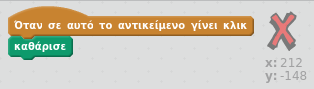
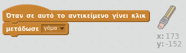
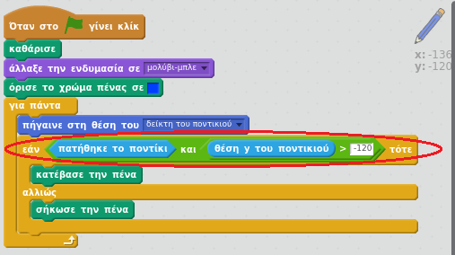

## Κάνοντας λάθη

Μερικές φορές συμβαίνουν λάθη, οπότε πρόσθεσε ένα κουμπί "καθαρισμός" και μια γόμα.

+ Πρόσθεσε το αντικείμενο "X-block" - θα το βρεις στη βιβλιοθήκη, στην ενότητα Γράμματα. Χρωμάτισε την ενδυμασία με κόκκινο. Αυτό θα είναι το κουμπί "Καθαρισμός".


+ Πρόσθεσε κώδικα σε αυτό το αντικείμενο για να καθαρίζεις το σκηνικό όταν πατηθεί.



Παρατηρήστε ότι δεν χρειάζεται να στείλετε ένα μήνυμα για να καθαρίσετε τη σκηνή, μπορείτε απλά να χρησιμοποιήσετε το σαφές μπλοκ από αυτό το sprite.

Ίσως έχετε παρατηρήσει ότι το στυλό μολυβιού σας περιλαμβάνει μια γόμα κοστούμι:


+ Το σχέδιό σας περιλαμβάνει επίσης ξεχωριστό sprite. Κάντε δεξί κλικ σε αυτό το sprite και επιλέξτε 'show'. Ακολουθεί ο τρόπος εμφάνισης της σκηνής σας:


+ Προσθέστε κώδικα στο σπάιτ γόμας, για να πείτε στο μολύβι να μεταβεί σε μια γόμα όταν πατηθεί το sprite.



Όταν το μολύβι λάβει το μήνυμα "γόμα", μπορείτε να αλλάξετε το κοστούμι μολυβιών στη γόμα και να αλλάξετε το χρώμα του μολυβιού σε λευκό - το ίδιο χρώμα με το σκηνικό!

+ Προσθέστε κάποιο κωδικό για να δημιουργήσετε τη γόμα

\--- συμβουλές \--- \--- υπαινιγμός \--- Προσθέστε κάποιο κωδικό στο στυλό μολυβιού: **Όταν λαμβάνω** το **σκουπάκι** μήνυμα **Αλλαγή στη φορεσιά** eraser **Ορισμός χρώματος στυλό** σε άσπρο \--- / υπαινιγμός \--- \--- υπαινιγμός \--- Εδώ είναι πώς ο κώδικας μέσα στο μολύβι σκίτσο θα πρέπει να εξετάσουμε:

```blocks
όταν λαμβάνω κοστούμι διακόπτη [γόμα v] στη [γόμα v] ορίστε το χρώμα της στυλό σε [#FFFFFF]
```

\--- / υπαινιγμός \--- \--- / υπαινιγμοί \---

+ Δοκιμάστε το έργο σας, για να δείτε εάν μπορείτε να καθαρίσετε και να διαγράψετε τη σκηνή.


Υπάρχει ένα ακόμα πρόβλημα με το μολύβι - μπορείτε να σχεδιάσετε οπουδήποτε στη σκηνή, συμπεριλαμβανομένων των εικονιδίων επιλογής!


Για να διορθώσετε αυτό, πείτε στο μολύβι μόνο να σχεδιάσετε εάν πατηθεί το ποντίκι *και* αν η θέση y του ποντικιού είναι μεγαλύτερη από -120:



+ Δοκιμάστε το έργο σας. δεν θα πρέπει πλέον να μπορείτε να πλησιάζετε τα μπλοκ επιλογέα.

