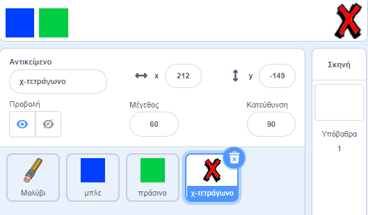
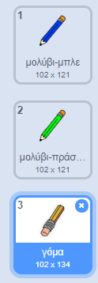

## Διόρθωσε λάθη

Μερικές φορές συμβαίνουν λάθη, οπότε πρόσθεσε ένα κουμπί "καθαρισμός" και μια γόμα.

\--- task \---

Πρόσθεσε το αντικείμενο 'X-block' από την ενότητα των γραμμάτων της βιβλιοθήκης. Χρωμάτισε την ενδυμασία του αντικειμένου με κόκκινο χρώμα και κάνε την λίγο μικρότερη. Αυτό το αντικείμενο θα είναι το κουμπί "Καθαρισμός".

[[[generic-scratch3-sprite-from-library]]]



\--- /task \---

\--- task \---

Πρόσθεσε κώδικα στο αντικείμενο "X-block" για να καθαρίσεις το Σκηνικό, όταν γίνει κλικ στο αντικείμενο.


```blocks3
when this sprite clicked
erase all
```

\--- /task \---

Δεν χρειάζεται να χρησιμοποιήσεις `εκπομπή`{:class="block3events"} για να καθαρίσεις το Σκηνικό, επειδή το μπλοκ `σβήσε τα πάντα`{:class="block3extensions"} κάνει αυτή την ενέργεια.

Βλέπεις ότι το αντικείμενο μολυβιού περιλαμβάνει μια ενδυμασία γόμας;



Το έργο σου περιλαμβάνει επίσης ένα ξεχωριστό αντικείμενο γόμας.

\--- task \---

Κάνε δεξί κλικ σε αυτό το αντικείμενο γόμας και στη συνέχεια κάνε κλικ στην **εμφάνιση**. Έτσι πρέπει να φαίνεται το Σκηνικό σου τώρα:


\--- /task \---

\--- task \---

Πρόσθεσε κώδικα στο αντικείμενο γόμας για να στείλεις μια `«εκπομπή γόμας»`{:class="block3events"} όταν πατηθεί το αντικείμενο γόμας.


```blocks3
όταν γίνει κλικ σε αυτό το αντικείμενο
μετάδωσε (γόμα v)
```

\--- /task \---

Όταν το μολύβι λάβει το μήνυμα "γόμα", μπορείς να αλλάξεις την ενδυμασία του μολυβιού στη γόμα και να αλλάξεις το χρώμα του μολυβιού σε λευκό, που είναι το ίδιο χρώμα με το σκηνικό!

\--- task \---

Πρόσθεσε κώδικα για να δημιουργήσεις τη γόμα.

\--- hints \--- \--- hint \---

Πρόσθεσε κώδικα στο αντικείμενο μολυβιού: `Όταν λάβω`{:class="block3events"} το μήνυμα `γόμα`{:class="block3events"} `Άλλαξε στην ενδυμασία γόμα`{:class="block3looks"} `Όρισε το χρώμα του μολυβιού`{:class="block3extensions"} σε άσπρο

\--- /hint \--- \--- hint \---

Εδώ είναι τα μπλοκ που χρειάζεσαι:

```blocks3
όρισε χρώμα πένας σε [#FFFFFF]

όταν λάβω [γόμα v]

άλλαξε ενδυμασία σε (γόμα v)
```

\--- /hint \--- \--- hint \---

Έτσι πρέπει να φαίνεται ο νέος σου κώδικας:


```blocks3
όταν λάβω [γόμα v]
άλλαξε ενδυμασία σε (γόμα v)
όρισε χρώμα πένας σε [#FFFFFF]
```

\--- /hint \--- \--- /hints \--- \--- /task \---

\--- task \---

Δοκίμασε το έργο σου για να δεις, εάν μπορείς να καθαρίσεις το Σκηνικό και να σβήσεις τις γραμμές μολυβιού.


\--- /task \---

Υπάρχει ένα ακόμα πρόβλημα με το μολύβι - μπορείς να σχεδιάσεις οπουδήποτε στο σκηνικό, συμπεριλαμβανομένων των κουμπιών εκκαθάρισης και γόμας!


\--- task \---

Για να το διορθώσεις, άλλαξε τον κώδικα έτσι ώστε η πένα να γράφει μόνο αν πατηθεί το ποντίκι **και** η `y` η συντεταγμένη του δείκτη του ποντικιού είναι μεγαλύτερη από `-120`:


```blocks3
όταν στην πράσινη σημαία γίνει κλικ
καθάρισέ τα  όλα
άλλαξε ενδυμασία σε (μολύβι-μπλε v)
όρισε χρώμα πένας σε [#0035FF]
για πάντα 
  πήγαινε σε (mouse pointer v)
  + εάν <<mouse down?> και <(y ποντικιού) > [-120]>>> τότε 
  +   κατέβασε πένα
  + αλλιώς 
  +   σήκωσε πένα
  + end
end
```

\--- /task \---

\--- task \---

Δοκίμασε το project σου. Τώρα δεν θα πρέπει να μπορείς να ζωγραφίζεις κοντά στα κουμπιά.


\--- /task \---