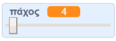

## Άλλαξε το πάχος του μολυβιού

Στη συνέχεια, θα προσθέσεις κώδικα για να επιτρέψεις στο άτομο που χρησιμοποιεί το πρόγραμμά σου να σχεδιάζει πράγματα με διαφορετικό πάχος μολυβιού.

--- task ---

Αρχικά, πρόσθεσε μία νέα μεταβλητή που ονομάζεται `πάχος`{:class="block3variables"}.

[[[generic-scratch3-add-variable]]]

--- /task ---

--- task ---

Πρόσθεσε αυτή τη γραμμή **μέσα** στο βρόχο `για πάντα`{:class="blockcontrol"} του κώδικα του μολυβιού:

```blocks3
when flag clicked
erase all
switch costume to (μολύβι-μπλε v)
set pen color to [#0035FF]
forever
go to (mouse pointer v)
+set pen size to (πάχος :: variables)
if <<mouse down?> and <(y ποντικιού) > [-120]>> then 
  pen down
  else
  pen up
end
```

--- /task ---

Τώρα το πάχος του μολυβιού επανειλημμένα ρυθμίζεται στην τιμή της μεταβλητής `πάχος`{:class="block3variables"}.

--- task ---

Κάνε δεξί κλικ στη μεταβλητή `πάχος`{:class="block3variables"} που εμφανίζεται στο Σκηνικό και, στη συνέχεια, κάνε κλικ στη **γραμμή κύλισης**.


--- /task ---

Τώρα μπορείς να σύρεις τη γραμμή κύλισης που βρίσκεται κάτω από τη μεταβλητή για να αλλάξεις την τιμή.



--- task ---

Δοκίμασε το έργο σου και δες αν μπορείς να προσθέσεις κώδικα για να ρυθμίσεις το πάχος του μολυβιού.


--- /task ---