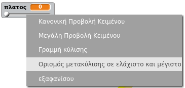

## Αλλαγή του πλάτους του μολυβιού

Ας επιτρέψουμε στο χρήστη να σχεδιάσει χρησιμοποιώντας μια σειρά διαφορετικών μεγεθών μολυβιού.

+ Αρχικά, προσθέστε μια νέα μεταβλητή που ονομάζεται `πλάτος`{: class = "blockvariable"}.

[[[generic-scratch-add-variable]]]

+ Προσθέστε αυτή τη γραμμή *μέσα στο* το `forever`{: class = "blockcontrol"} βρόχος του κώδικα του μολυβιού:

```blocks
    ορίστε το μέγεθος του στυλό στο (πλάτος)
```

Το πλάτος του μολυβιού θα ρυθμιστεί επανειλημμένα στην τιμή της μεταβλητής 'πλάτος'.

+ Κάντε δεξί κλικ στη μεταβλητή οθόνη της σκηνής και κάντε κλικ στο "ρυθμιστικό".


Τώρα μπορείτε να σύρετε το ρυθμιστικό κάτω από τη μεταβλητή για να αλλάξετε την τιμή.


+ Δοκιμάστε το έργο σας και δείτε εάν μπορείτε να τροποποιήσετε το πλάτος του μολυβιού.


Αν προτιμάτε, μπορείτε να ορίσετε την ελάχιστη και τη μέγιστη τιμή του "πλάτους" που επιτρέπεται. Για να το κάνετε αυτό, κάντε δεξί κλικ στη μεταβλητή ξανά και κάντε κλικ στο 'set slider min and max'. Ορίστε τις ελάχιστες και μέγιστες τιμές της μεταβλητής σας σε κάτι πιο λογικό, όπως 1 και 20.



Συνεχίστε να ελέγχετε τη μεταβλητή "πλάτους" μέχρι να είστε ευχαριστημένοι.