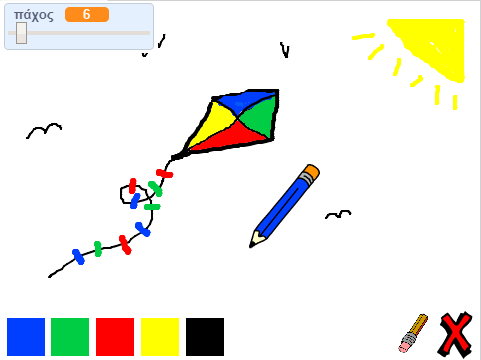

--- challenge ---

## Πρόκληση: περισσότερα μολύβια

Μπορείς να προσθέσεις κόκκινο, κίτρινο και μαύρο μολύβι στο πρόγραμμα ζωγραφικής; Ρίξε μια ματιά στο βήμα 2 παραπάνω εάν έχεις ξεχάσει πώς να το κάνεις. Θυμήσου επίσης να προσθέσεις συντομεύσεις πληκτρολογίου για αυτά τα νέα μολύβια.

Μπορείς να χρησιμοποιήσεις τα μολύβια σου για να σχεδιάσεις μια εικόνα;

--- /challenge ---

***

Το έργο αυτό μεταφράστηκε από τους εθελοντές:

Γιώργος Νικολαΐδης

Δήμητρα Θεοδώρου

Χάρη στους εθελοντές, μπορούμε να δώσουμε σε ανθρώπους σε όλο τον κόσμο την ευκαιρία να μάθουν στη γλώσσα τους. Μπορείτε να μας βοηθήσετε να προσεγγίσουμε περισσότερους ανθρώπους μεταφράζοντας εθελοντικά - περισσότερες πληροφορίες στο [rpf.io/translate](https://rpf.io/translate).