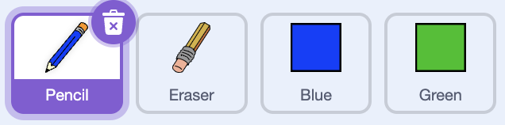

## Make a pencil

Start by making a pencil that you can use to draw.

--- task ---

Open the 'Paint box' Scratch starter project at [rpf.io/paint-box-on](https://rpf.io/paint-box-on){:target="_blank"}

If you have a Scratch account you can make a copy by clicking **Remix**.

--- /task ---

In the starter project, you should see pencil, eraser and two square sprites:



--- task ---

Add the Pen extension to your project.

[[[generic-scratch3-add-pen-extension]]]

--- /task ---

--- task ---

Add some code to the pencil sprite to make the sprite follow the mouse pointer `forever`{:class="block3control"}:


```blocks3
when flag clicked
forever
  go to (mouse pointer v)
end
```

--- /task ---

--- task ---

Test your code.

Click the flag and then move the mouse pointer around the Stage to test whether your code works. The pencil should move with the mouse.

--- /task ---

Next, make your pencil only draw `if`{:class="block3control"} the mouse button is being clicked.

--- task ---

Add this code to your pencil sprite:


```blocks3
when flag clicked
forever
  go to (mouse pointer v)
+ if <mouse down?> then
  pen down
  else
  pen up
end
```

--- /task ---

--- task ---

Test your code again. 

This time, move the pencil around the Stage and hold down the mouse button. Can you draw with your pencil?


--- /task ---