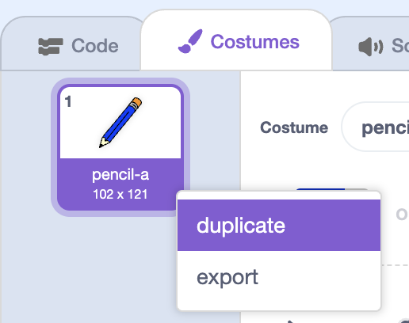

## Coloured pens

Let's add different colour pens to your project, and allow the user to choose between them!


+ Click on your pencil sprite, click 'Costumes' and duplicate your 'pencil-blue' costume.

	

+ Rename your new costume 'pencil-green', and colour the pencil green.

	

+ Create two new sprites, which you will use to select the blue or green pencil.

	

+ When the green selector icon is clicked, you need to `broadcast`{:class="blockevents"} a message to the pencil sprite, telling it to change its costume and pencil colour.

	To do this, first add this code to the green selector icon:

	```blocks
		when this sprite clicked
		broadcast [green v]
	```

	To create the `broadcast`{:class="blockevents"} block, click the down arrow and select 'new message...'.

	

	You can then type 'green' to create your new message.

	

+ You now need to tell your pencil sprite what to do when it receives the message. Add this code to your pencil sprite:

	```blocks
		when I receive [green v]
		switch costume to [pencil-green v]
		set pen color to [#00ff00]
	```

	To set the pencil to colour to green, click the coloured box in the `set color`{:class="blockpen"} block, and click on the green selector icon to choose green as your pencil colour.

+ You can now do the same for the blue pencil icon, adding this code to the blue selector sprite:

	```blocks
		when this sprite clicked
		broadcast [blue v]
	```

	...and adding this code to the pencil sprite:

	```blocks
		when I receive [blue v]
		switch costume to [pencil-blue v]
		set pen color to [#0000ff]
	```

+ Finally, you need to tell your pencil sprite what costume and pencil colour to choose, as well as clearing the screen, when your project is started. Add this code to the beginning of the pencil's `when flag clicked`{:class="blockevents"} code (before the `forever`{:class="blockcontrol"} loop):

	```blocks
		clear
		switch costume to [blue-pencil v]
		set pen color to [#0000ff]
	```

	If you prefer, you can start with a different colour pencil!

+ Test out your project. Can you switch between blue and green pens?

	


