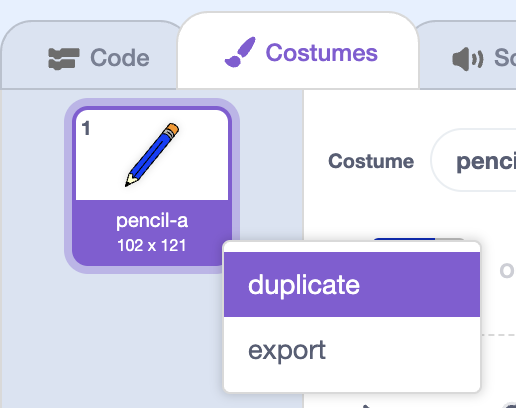

## Coloured pencils

Let's add different coloured pencils to your project, and allow the user to choose between them.

+ Click on your pencil sprite, click 'Costumes' and duplicate your 'pencil-blue' costume.



+ Rename your new costume 'pencil-green', and colour the pencil green.


+ Draw two new sprites - one blue square and one green square. You will use these to select the blue or green pencil.


+ Rename your sprites so that they are called **blue** and **green**

[[[generic-scratch-rename-sprite]]]

+ Add some code to the **green** sprite so that when it is clicked, it will `broadcast`{:class="blockevents"} the message "green" to the pencil sprite, telling it to change its costume and pencil colour.


[[[generic-scratch-broadcast-message]]]

+ Switch to your pencil sprite. Add some code so that when this sprite receives the `broadcast`{:class="blockevents"} green, it should switch to the green pencil costume and change the pen colour to green.


To set the pencil to colour to green, click the coloured box in the `set color`{:class="blockpen"} block, and click on the green sprite to choose the same colour green as your pencil colour.

+ You can now do the same for the blue pencil icon, adding this code to the blue selector sprite:

```blocks
	when this sprite clicked
	broadcast [blue v]
```

...and adding this code to the pencil sprite:

```blocks
	when I receive [blue v]
	switch costume to [pencil-blue v]
	set pen color to [#0000ff]
```

+ Finally, you need to tell your pencil sprite what costume and pencil colour to choose, as well as clearing the screen, when your project is started. Add this code to the beginning of the pencil's `when flag clicked`{:class="blockevents"} code (before the `forever`{:class="blockcontrol"} loop):


If you prefer, you can start with a different colour pencil!

+ Test out your project. Can you switch between blue and green pens by clicking on the blue or green square sprites?


