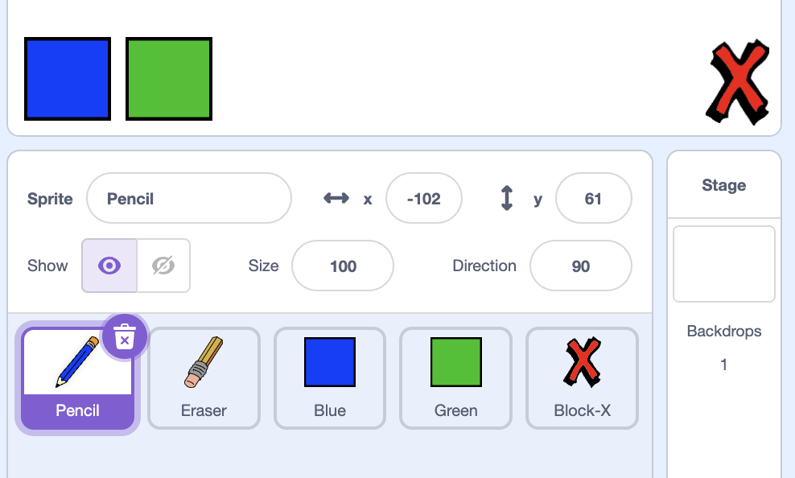

## Making mistakes

Sometimes mistakes happen, so let's add a 'clear' button and an eraser.

--- task ---
Add the 'X-block' sprite - you will find it in the library, in the letters section. Colour the costume in red. This will become the 'clear' button.

[[[generic-scratch-sprite-from-library]]]


--- /task ---

--- task ---
Add code to this sprite to clear the stage when it's clicked.


```blocks
when this sprite clicked
clear
```

--- /task ---

Notice that you don't need to send a message to clear the stage, you can just use the clear block from this sprite.

You have probably noticed that your pencil sprite includes an eraser costume:


--- task ---
Your project also includes a separate eraser sprite. Right click on this sprite and choose 'show'. Here is how your stage should look:


--- /task ---

--- task ---
Add code to the eraser sprite, to tell the pencil to switch to an eraser when the sprite is clicked.


```blocks
when this sprite clicked
broadcast [eraser v]
```
--- /task ---

When the pencil receives the "eraser" message, you can switch the pencil costume to the eraser, and switch the pencil colour to white - the same colour as the stage!

--- task ---
Add some code to create the eraser

--- hints ---
--- hint ---
Add some code to the pencil sprite:
`When I receive`{:class="blockevents"} the `eraser`{:class="blockevents"} message
`Switch to costume eraser`{:class="blocklooks"} 
`Set pen color`{:class="blockpen"} to white
--- /hint ---
--- hint ---
Here are all the blocks you will need.
```blocks
set pen color to [#FFFFFF]
when I receive [eraser v]

switch costume to [eraser v]
```
--- /hint ---
--- hint ---
Here is how the code inside the pencil sprite should look:
```blocks
when I receive [eraser v]
switch costume to [eraser v]
set pen color to [#FFFFFF]
```
--- /hint ---
--- /hints ---
--- /task ---

--- task ---
+ Test your project, to see if you can clear and erase on the stage.


--- /task ---

There's one more problem with the pencil - you can draw anywhere on the stage, including near the selector icons!


--- task ---
To fix this, change the code so that the pencil only draws if the mouse is clicked _and_ if the y-position of the mouse is greater than -120:


```blocks
when flag clicked
clear
switch costume to [pencil-blue v]
set pen color to [#0035FF]
forever
  go to [mouse pointer v]
+if <<mouse down?> and <(mouse y) > [120]>> then 
  pen down
  else
  pen up
end
```
--- /task ---

--- task ---
Test your project; you now shouldn't be able to draw near the selector blocks.


--- /task ---
