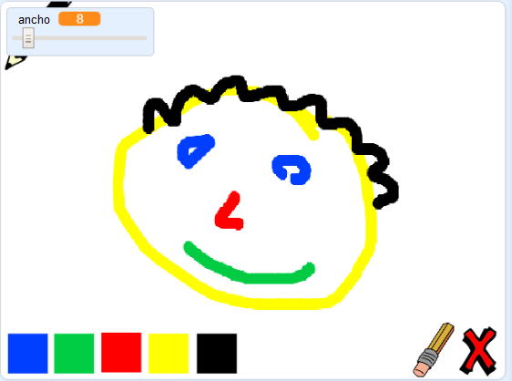

--- no-print ---

Esta es una versión de **Scratch 3** del proyecto. También hay una [versión del proyecto en Scratch 2](https://projects.raspberrypi.org/es-ES/projects/paint-box-scratch2).

--- /no-print ---

## Introducción

¡Haz tu propio programa de dibujo!

### Lo que harás

--- no-print --- Haz clic en la bandera verde para comenzar. Utiliza el ratón para mover el lápiz, y mantén presionado el botón de la izquierda para dibujar. Haz clic en un color para cambiar de lápiz. Haz clic en el borrador para cambiar de función, y utilízalo para borrar lo que hayas hecho. Para limpiar la página, haz clic en la cruz.

  <iframe allowtransparency="true" width="485" height="402" src="//scratch.mit.edu/projects/embed/267243161/?autostart=false" frameborder="0" scrolling="no"></iframe>
  

--- /no-print ---

--- print-only --- Harás clic en la bandera verde para comenzar, y utilizarás el ratón para mover el lápiz y mantener apretado el botón izquierdo para dibujar. Hacer clic en el color cambiará el color del lápiz, y haciendo clic en el borrador, ¡cambiará la función a borrador!

 --- /print-only ---

--- collapse ---
---
title: Lo que aprenderás
---

+ Cómo utilizar la extensión de marcador en Scratch
+ Cómo utilizar los enunciados para comunicar entre objetos
+ Cómo detectar los movimientos del ratón --- /collapse ---

--- collapse ---
---
title: Lo que necesitarás
---

### Hardware

+ Ordenador capaz de ejecutar Scratch 3

### Software

+ Scratch 3 ([en línea](http://rpf.io/scratchon){:target="_blank"} o [sin conexión](http://rpf.io/scratchoff){:target="_blank"})

### Descargas

+ [Offline starter project](http://rpf.io/p/es-ES/paint-box-go){:target="_blank"}

--- /collapse ---

--- collapse ---
---
title: Información adicional para educadores
---

Si necesitas imprimir este proyecto, usa la [versión para imprimir](https://projects.raspberrypi.org/es-ES/projects/paint-box/print){:target="_blank"}.

Puedes [encontrar la solución para este proyecto aquí](http://rpf.io/p/es-ES/paint-box-get){:target="_blank"}. --- /collapse ---