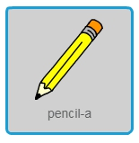
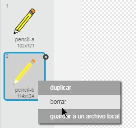
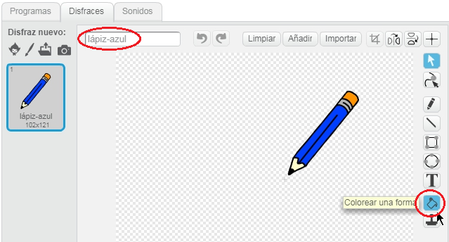
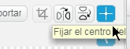
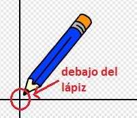
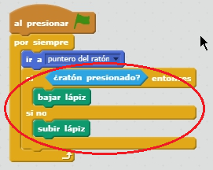

## Crear un lápiz

Empezaremos por crear un lápiz, que puedes usar para dibujar en el escenario.

+ Empieza un nuevo proyecto de Scratch, y borra el objeto gato para que tu proyecto esté vacío. Puedes encontrar el editor de Scratch en línea en <a href="http://jumpto.cc/scratch-new">jumpto.cc/scratch-new</a>.

+ Añade el objeto lápiz a tu proyecto.

	

+ Haz clic en “Disfraces”, y elimina el disfraz “pencil-b”.

	

+ Cámbiale el nombre al disfraz por “lápiz-azul”, y usa la herramienta “Colorear una forma” para hacer que el lápiz sea azul.

	

+ Como vas a usar el ratón para dibujar, querrás que tu lápiz siga al ratón “por siempre” {.blockcontrol}. Añade este código a tu objeto lápiz:

	```blocks
		al presionar bandera verde
		por siempre
		  ir a [puntero del ratón v]
		fin
	```

+ Prueba el código haciendo clic en la bandera y luego moviendo el ratón por el escenario. ¿Funciona como esperabas?

+ ¿Te has dado cuenta de que es el centro del lápiz y no la punta, lo que sigue al puntero del ratón?

	

	Para arreglar esto, haz clic en el disfraz “lápiz-azul” del objeto lápiz, y haz clic en Fijar el centro del disfraz”.

	

+ Deberías de ver una cruz que aparece en el disfraz. Ahora haz clic justo debajo de la punta del lápiz, para fijar este punto como el centro del disfraz.

	

+ Haz clic en la pestaña “Programas”, y luego prueba tu lápiz una vez más. ¿Funciona mejor que antes?

+ Ahora haremos que el lápiz dibuje `si` {.blockcontrol} hacemos clic en el ratón. Añade este código al objeto lápiz:

	

+ Prueba tu código una vez más. Esta vez, mueve el lápiz por el escenario y mantén apretado el botón del ratón. ¿Puedes dibujar con el lápiz?

	
	


