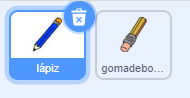
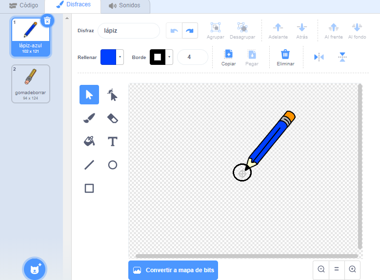

## Lo que necesitarás

Comienza haciendo un lápiz que puedes utilizar para dibujar en un Escenario.

--- task --- Abre la 'caja de pintura' del proyecto de inicio de Scratch.

**Online**: abre el proyecto de inicio en[rpf.io/caja de pintura](http://rpf.io/paint-box-on){:target="_blank"}

**Offline**: abre el [proyecto de inicio](http://rpf.io/p/es-ES/paint-box-go){:target=_blank"} en el editor offline.

Si necesitas descargar e instalar el editor offline de Scratch, puedes encontrarlo en [rpf.io/scratchoff](http://rpf.io/scratchoff){:target="_blank"}

En el proyecto de inicio, deberías ver los objetos lápiz y borrador:

 --- /task ---

--- task ---

Añade la extensión de marcador a tu proyecto.

[[[generic-scratch3-add-pen-extension]]]

--- /task ---

--- task ---

Añade algo de código al objeto lápiz para hacer que el objeto siga al cursor `forever`{:class="block3control"} así puedes dibujar:


```blocks3
cuando se haga clic en la bandera
siempre
ir a (cursor del ratón v)
fin
```

--- /task ---

--- /task--- Haz clic en la bandera y luego mueve el cursor alrededor del Escenario para comprobar si tu código funciona. --- /task ---

Luego, haz que tu lápiz sólo dibuje `if`{:class="block3control"} si se mantiene presionado el botón del ratón.

--- task --- Añade este código al objeto de tu lápiz:


```blocks3
cuando se haga clic en la bandera
siempre
ir a (cursor del ratón v)

+if<mouse down?>then
marcador abajo
o
marcador arriba
fin
```

--- /task ---

--- task --- Comprueba tu código nuevamente. Esta vez, mueve el lápiz alrededor del Escenario y mantiene presionado el botón del ratón. ¿Puedes dibujar con tu lápiz?

 --- /task ---

--- collapse ---
---
title: ¿Tu lápiz no dibuja desde la punta?
---

Si la línea que tu lápiz dibuja parece que saliera del medio de tu lápiz, necesitas cambiar el sprite de tu lápiz para que la punta sea el centro del sprite.

Haz clic el sprite de lápiz, y luego haz clic sobre la pestaña **Disfraces**.

Mueve la pestaña de disfraces para que la punta del lápiz esté **justo encima** del centro.



Ahora mueve el lápiz alrededor del Escenario y dibuja. El lápiz ahora debería dibujar una línea desde su punta.

--- /collapse ---