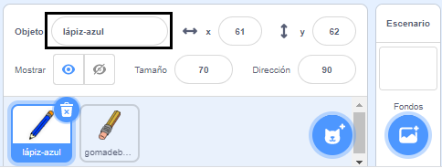
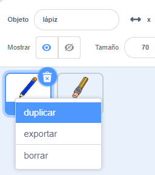
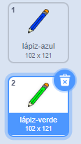
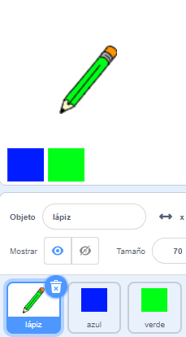

## Lápices de colores

Ahora vas a añadir diferentes lápices de colores a tu proyecto y permitir que el usuario elija entre los mismos.

\--- task \--- Rename the `pencil` sprite to `pencil-blue`

 \--- /task \---

\--- task \--- Right click on the pencil sprite, and duplicate the 'pencil-blue' costume.

 \--- /task \---

\--- task \--- Nombra el nuevo disfraz 'lápiz-verde', y colorea el lápiz de verde.



\--- /task \---

\--- task \--- Dibuja dos nuevos objetos: un cuadrado azul y uno verde. Estos sirven para elegir entre el lápiz azul y el verde.

 \--- /task \---

\--- task \--- Renombra los nuevos objetos para que se llamen 'azul' y 'verde'

[[[generic-scratch3-rename-sprite]]]

\--- /task \---

\--- task \--- Añade algún código al objeto 'verde', de modo que cuando se haga clic en este objeto, se `envía`{:class="block3events"} el mensaje "verde".


```blocks3
cuando se haga clic en este objeto
enviar (verde v)
```

[[[generic-scratch3-broadcast-message]]] \--- /task \---

El objeto lápiz debería 'escuchar' los mensajes "verde" y cambiar su disfraz y color de lápiz como respuesta.

\--- task \--- Cambia a tu objeto lápiz. Añade algún código de modo que cuando este objeto reciba el envío `verde`{:class="block3events"}, cambia al disfraz de lápiz verde y cambia el color del marcador a verde.


```blocks3
cuando recibo [verde v]
cambiar el disfraz a (lápiz-verde v)
fijar el color del marcador a [#00C44]
```

Para establecer el lápiz de color a verde, haz clic en el cuadrado de color en el bloque `fijar color del lápiz`{:class="block3extensions"}, y luego haz clic en el objeto cuadrado verde. \--- /task \---

Luego para cosas similares, para que puedas cambiar de color de lápiz a azul.

\--- task \--- Haz clic en el objeto cuadrado azul y añade este código:


```blocks3
cuando se hace clic en este objeto
enviar (azul v)
```

Luego, haz clic sobre el objeto lápiz y añade este código: 

```blocks3
cuando recibo [azul v]
cambiar disfraz a (lápiz-azul v)
fijar color del marcador a [#0000ff]
```

\--- /task \---

\--- task \--- Finalmente, añade este código para indicarle al objeto lápiz con qué color comenzar, y asegurarte de que la pantalla esté limpia cuando comiences.


```blocks3
cuando se haga clic en la bandera
+borrar todo
+cambiar disfraz a (lápiz-azul v)
+fijar color del marcador a [#0035FF]
siempre
ir a (cursor del ratón v)
if<mouse down?>then
marcador abajo
o 
marcador arriba
fin
```

\--- /task \---

Si prefieres, puedes comenzar con un lápiz de color diferente.

\--- task \--- Prueba tu código. ¿Puedes cambiar entre el color de lápiz verde y el azul al cliquear en los objetos cuadrado azul o verde?

 \--- /task \---