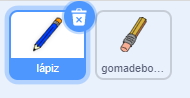
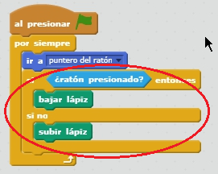

## Hacer un lápiz

Comencemos haciendo un lápiz que se pueda usar para dibujar en el escenario.

+ Abre el projecto 'Paintbox' de Scratch online en [jumpto.cc/paint-go](http://jumpto.cc/paint-go){:target="_blank"} o descárgalo primero de <http://jumpto.cc/paint-get>{:target="_blank"} y ábrelo luego en tu editor offline.

Verás figuras de lápiz y de goma de borrar:



+ Añade algo de código a la figura del lápiz para que siga el movimiento del ratón `por siempre`{:class="blockcontrol"} para que puedas dibujar:

```blocks
    al presionar bandera verde
por siempre 
  ir a [puntero del ratón v]
end
```

+ Haz clic en la bandera y luego mueve el ratón por el escenario para comprobar si el código funciona.

Ahora vamos a hacer que tu lápiz solo dibuje `si`{:class="blockcontrol"} haces clic con el ratón.

+ Añade este código a la figura de tu lápiz:



+ Vuelve a probar tu código. Esta vez, mueve el lápiz por el escenario y mantén presionado el botón del ratón. ¿Puedes dibujar con tu lápiz?


## \--- collapse \---

## title: Si tienes problemas ...

Si parece que el lápiz está dibujando la línea con el centro del lápiz en vez de con la punta, tienes que cambiar el centro del disfraz.


La cruz del lápiz debe colocarse **justo debajo** de la punta del lápiz, no encima de la punta del lápiz.

A changes in a sprite's 'costume center' isn't registered until another tab is clicked, so click on another costume, or on the 'Scripts' tab to finalise your changes to the costume center.

\--- /collapse \---