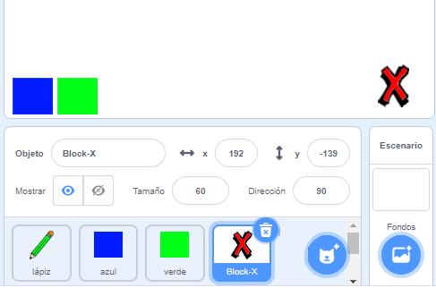
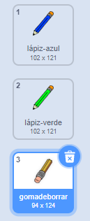
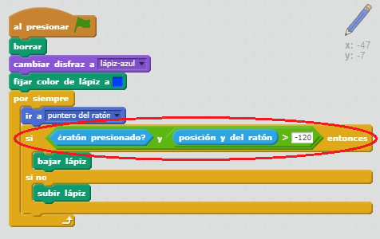

## Cometer errores

¡A veces se comenten errores, asi que vamos a añadir un botón de “limpiar” y una goma a nuestro proyecto!

+ Vamos a añadir un botón para limpiar el escenario. Para hacer esto, añade el objeto de la letra 'X-block' al escenario, y píntalo de rojo.

	

+ Añade este código a tu nuevo botón de cancelar para limpiar el escenario al presionarlo.

	```blocks
		al hacer clic en este objeto
		borrar
	```

	¡Fíjate que no necesitas enviar un mensaje para limpiar el escenario, ya que cualquier objeto puede hacerlo!

+ También puedes crear un borrador. Si el líder del club te ha dado una carpeta de “Recursos”, haz clic en “Cargar disfraz desde archivo” y añade la imagen “eraser.svg”.

	

	¡Si no tienes la imagen eraser.svg, crea en su lugar un nuevo lápiz blanco!

+ También deberías añadir la imagen del borrador como un nuevo objeto selector. Tu escenario debería de parecerse a éste:

	

+ A continuación puedes añadir este código al objeto selector borrador, para decirle al lápiz que se convierta en borrador.

	```blocks
		al hacer clic en este objeto
		enviar [borrador v]
	```

+ ¡Cuando el lápiz recibe este mensaje, puedes crear un borrador haciendo que se cambie el disfraz del lápiz al de borrador, y cambiando el color del lápiz al mismo color del escenario!

	```blocks
		al recibir [borrador v]
		cambiar disfraz a [borrador v]
		fijar color de lápiz a [#FFFFFF]
	```

+ Prueba tu proyecto para ver si puedes limpiar y borrar en el escenario.

	

+ Hay otro problema con el lápiz – puedes dibujar en cualquier parte del escenario, ¡incluso cerca de los íconos selectores!

	

	Para arreglar esto, tienes que decir al lápiz que sólo dibuje si se hace clic en el ratón _y_ si la posición y del ratón es mayor a -110 (`mouse y`{:class="blocksensing"}`> -120`{:class="blockoperators"}). Cambia la instrucción `si`{:class="blockcontrol"} de tu lápiz para que sea como ésta:

	

+ Prueba tu proyecto. Ahora no deberías poder dibujar cerca de los bloques selectores.

	


