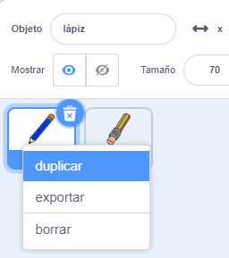

## Lápices de colores

Vamos a añadir diferentes lápices de colores a tu proyecto y a permitir al usuario elegir entre ellos.

+ Haz clic en tu objeto lápiz lápiz, luego haz clic en 'Disfraces' y duplica el disfraz 'lápiz azul'.



+ Cambia el nombre de tu nuevo disfraz a 'lápiz verde' y cambia el color del lápiz a verde.


[[[generic-scratch-rename-sprite]]]

+ Dibuja dos objetos más - un cuadrado azul y un cuadrado verde. Los usarás para seleccionar el lápiz de color azul o el lápiz de color verde.


+ Renombra tus objetos para que se llamen 'azul' y 'verde'

+ Añade código al objeto 'verde' de forma que cuando hagas clic encima `envíe`{:class="blockevents"} el mensaje 'verde' al objeto lápiz, indicándole que cambie su disfraz y su color.


[[[generic-scratch-broadcast-message]]]

+ Cambia al objeto lápiz. Añade código para que cuando este objeto reciba el mensaje `enviar`{:class="blockevents"} verde, cambie al disfraz de lápiz verde y cambie el color con el que dibuja el lápiz a verde.


Para ajustar el color con el que dibuja el lápiz a verde, haz clic en el cuadrado de color del bloque `fijar color del lápiz a`{:class="blockpen"}, y luego haz clic en el objeto verde para elegir el mismo color verde que el de tu lápiz.

+ You can now do the same for the blue pencil icon: add this code to the blue square sprite:

```blocks
when this sprite clicked
broadcast [blue v]
```

...and add this code to the pencil sprite:

```blocks
when I receive [blue v]
switch costume to [pencil-blue v]
set pen color to [#0000ff]
```

+ Finally, add this code to tell the pencil sprite which colour to start with, and make sure that the screen is clear.


We chose to start with blue but if you prefer, you can start with a different colour pencil.

+ Test out your project. Can you switch between blue and green pens by clicking on the blue or green square sprites?

