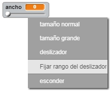

## Cambiar el grosor del lápiz

Vamos a hacer que el usuario pueda dibujar utilizando diferentes tamaños de lápices.

+ Primero, añade una nueva variable que se llame "grosor". Si no recuerdas cómo hacerlo, el Proyecto “Globos” te puede ayudar.

+ Añade esta línea _dentro_ del bucle de código `por siempre` {.blockcontrol} de tu lápiz:

	```blocks
		fijar tamaño de lápiz a (grosor)
	```

	Ahora el grosor de tu lápiz se fijará repetidamente al valor de la variable “grosor”.

+ Puedes cambiar el valor guardado en esta variable haciendo clic con el botón derecho sobre la variable (en el escenario) y seleccionando “deslizador”.

	

	Ahora puedes arrastrar el deslizador que hay debajo de la variable para cambiar su valor.

	

+ Prueba tu proyecto, y comprueba si puedes modificar el grosor de tu lápiz.

	

	Si lo prefieres, puedes fijar el valor mínimo y máximo del “grosor” permitido. Para hacerlo, haz clic de nuevo con el botón derecho sobre la variable y selecciona “fijar rango del deslizador”. Fija los valores mínimos y máximos de tu variable a algo un poco más coherente, como 1 y 20.

	

	Sigue probando tu variable “grosor” hasta que estés conforme.


