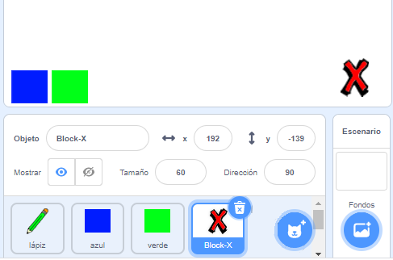
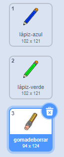

## Cometiendo errores

A veces se comenten errores, así que añade un botón 'limpiar' y un botón borrador.

--- task --- Añade el objeto 'X-block' desde la sección de letras de biblioteca. Colorea el disfraz de objeto de rojo y hazlo más pequeño. Este objeto es el botón 'limpiar'.

[[[generic-scratch3-sprite-from-library]]]

 --- /task ---

--- task --- Añade código al objeto 'X-block' para limpiar el Escenario cuando se haga clic en el objeto.


```blocks3
cuando se hace clic en este objeto
borrar todo
```

--- /task ---

No necesitas utilizar un `enviar`{:class="block3events"} para limpiar el Escenario, porque el bloque `borrar todo`{:class="block3extensions"} cumple con esa función.

¿Ves que el objeto lápiz incluya un disfraz de borrador?



Tu proyecto también incluye un objeto goma de borrar aparte.

--- task --- Haz clic con el botón derecho sobre el objeto borrador y luego haz clic sobre **mostrar**. Aquí se ve cómo debería quedar tu Escenario ahora:

 --- /task ---

--- task --- Añade código al objeto borrador para enviar un `enviar 'borrador'`{:class="block3events"} cuando se hace clic en el objeto borrador.


```blocks3
cuando se hace clic en este objeto
enviar (borrador v)
```

--- /task ---

Cuando el objeto lápiz recibe el mensaje 'borrador', debería cambiar su disfraz al borrador y cambiar el color del marcador a blanco, ¡que es del mismo color que el Escenario!

--- task --- Añade algo de código para crear un borrador.

--- hints ---
 --- hint --- Añade algo de código al objeto lápiz: `Cuando reciba`{:class="block3events"} el mensaje `borrador`{:class="block3events"} `Cambia a borrador de disfraz`{:class="block3looks"} `Fija el color del marcador`{:class="block3extensions"} a blanco
--- /hint ---
 --- hint --- Aquí están todos los bloques que necesitas:

```blocks3
fijar el color del marcador a [#FFFFFF]
cuando reciba [borrador v]

cambia el disfraz a (borrador v)
```

--- /hint --- --- hint --- Aquí está cómo debería lucir el código: 

```blocks3
cuando reciba [borrador v]
cambia disfraz a (borrador v)
fija el color del marcador a [#FFFFFF]
```

--- /hint ------ /hints --- --- /task ---

--- task --- Evalúa tu proyecto para ver si puedes limpiar el Escenario y borrar las líneas del lápiz.

 --- /task ---

Hay un problema más con el lápiz: puedes dibujar en cualquier lugar del Escenario, ¡incluyendo el espacio cerca de los botones 'limpiar' y borrador!


--- task --- Para arreglar esto, cambia el código de modo que el marcador esté sólo abajo si se hace clic en el ratón **y** la posición del cursor del ratón `y` sea mayor que `120`:


```blocks3
cuando se haga clic en la bandera
borrar todo
cambia disfraz a (lápiz-azul v)
fijar el color del marcador a [#0035FF]
siempre
ir a (cursor del ratón v)
+if <<mouse down?> and <(mouse y) > [-120]>> then 
marcador abajo
o
marcador arriba
fin
```

--- /task ---

--- task --- Evalúa tu proyecto. Ahora no deberías ser capaz de dibujar cerca de los botones.

 --- /task ---