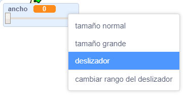
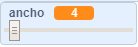

## Cambiar el ancho del marcador

Luego vas a añadir código para permitir que el usuario de tu programa dibuje cosas con diferentes grosores de marcador.

\--- task \--- Primero, añade una nueva variable llamada `ancho`{:class="block3variables"}.

[[[generic-scratch3-add-variable]]] \--- /task \---

\--- task \--- Añade esta línea **dentro** del bucle `forever`{:class="block3control"} del código del objeto lápiz:

```blocks3
cuando se hace clic en la bandera
borrar todo
cambiar disfraz a (lápiz-azul v)
fijar color de marcador a [#0035FF]
siempre
ir a (cursor del ratón v)
+ fijar grosor del marcador a (ancho:: variables)
if <<mouse down?> and <(mouse y) > [-120]>> then
marcador abajo
o
marcador arriba
fin
```

\--- /task \---

El ancho del marcador ahora se vuelve repetidamente del valor de la variable `ancho`{:class="block3variables"}.

\--- task \--- Haz clic a la derecha de la variable `ancho`{:class="block3variables"} que se muestra en el Escenario, y luego haz clic en **deslizador**.

 \--- /task \---

Ahora puedes arrastrar el deslizador que se ve debajo de la variable para cambiar el valor de la misma.



\--- task \--- Prueba tu proyecto y mira si puedes añadir código para ajustar el ancho del marcador.

 \--- /task \---