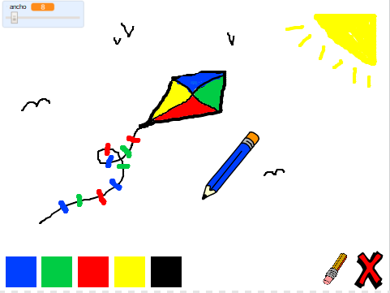

\--- challenge \---

## Desafío: más colores

¿Puedes añadir los colores rojo, amarillo y negro a tu programa para pintar? Mira el paso 2 arriba si has olvidado como hacer esto. Recuerda añadir atajos de teclado para estos nuevos colores también.

¿Puedes usar tus nuevos colors para hacer un dibujo?

\--- /challenge \---