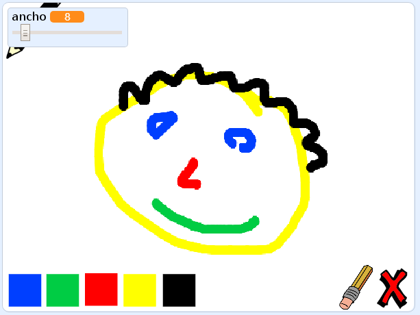

\--- no-print \---

Esta es la versión **Scratch 3** del proyecto. También hay una [versión del proyecto en Scratch 2](https://projects.raspberrypi.org/en/projects/paint-box-scratch2).

\--- /no-print \---

## Introducción

¡Realiza tu propio programa para dibujar!

### Lo que harás

\--- no-print \---

Haz clic en la bandera verde para empezar. Utiliza el ratón para mover el lápiz, y mantén presionado el botón de la izquierda para dibujar. Haz clic en un color para cambiar de lápiz. Haz clic en el borrador para seleccionarlo, y utilízalo para borrar lo que hayas hecho. Para borrar la página, haz clic en la equis.

  <iframe allowtransparency="true" width="485" height="402" src="//scratch.mit.edu/projects/embed/267243161/?autostart=false" frameborder="0" scrolling="no"></iframe>
  

\--- /no-print \---

\--- print-only \---

Para comenzar, harás clic en la bandera verde y usarás el ratón para mover el lápiz y mantendrás presionado el botón izquierdo del ratón para dibujar. Hacer clic en el color cambiará el color del lápiz, y haciendo clic en el borrador, ¡cambiará la función a borrador!

\--- /print-only \---

## \--- collapse \---

## title: Lo que vas a aprender

+ Agrega la extensión de lápiz en Scratch
+ Usa transmisiones para controlar un objeto de Scratch
+ Recuerda cómo responder a los eventos del ratón en Scratch

\--- /collapse \---

## \--- collapse \---

## title: Lo que vas a necesitar

### Equipo

+ Una computadora capaz de correr Scratch 3

### Programa

+ Scratch 3 (either [online](https://rpf.io/scratchon){:target="_blank"} or [offline](https://rpf.io/scratchoff){:target="_blank"})

### Descargas

+ [Offline starter project](https://rpf.io/p/en/paint-box-go){:target="_blank"}

\--- /collapse \---

## \--- collapse \---

## title: Información adicional para educadores

Si necesitas imprimir este proyecto, usa la [versión para imprimir](https://projects.raspberrypi.org/en/projects/paint-box/print){:target="_blank"}.

You can find the [completed project here](https://rpf.io/p/en/paint-box-get){:target="_blank"}.

\--- /collapse \---