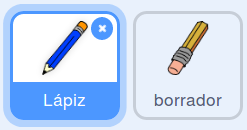
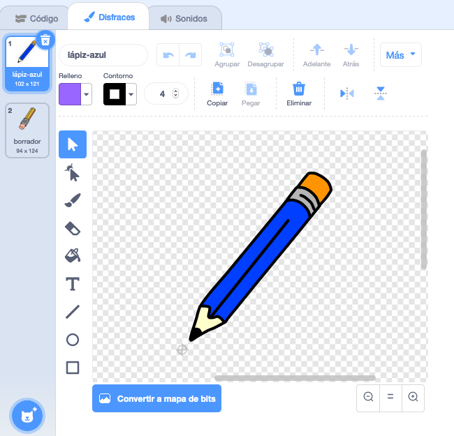

## Haz un lápiz

Comienza haciendo un lápiz que puedes utilizar para dibujar en un Escenario.

\--- task \--- Abre la 'caja de pintura' del proyecto de inicio de Scratch.

** Online **: abra un nuevo proyecto Scratch en línea en [ rpf.io/paint-box-on ](http://rpf.io/paint-box-on)"}

**Offline**: abre el [proyecto de inicio](http://rpf.io/p/en/paint-box-go){:target=_blank"} en el editor offline.

Si necesitas descargar e instalar el editor offline de Scratch, puedes encontrarlo en [rpf.io/scratchoff](http://rpf.io/scratchoff){:target="_blank"}

In the starter project, you should see pencil and eraser sprites:

 \--- /task \---

\--- task \---

Añadir la extensión de la lápiz a su proyecto.

[[[generic-scratch3-add-pen-extension]]]

\--- /task \---

\--- task \---

Añade algo de código al objeto lápiz para hacer que el objeto siga al cursor `forever`{:class="block3control"} así puedes dibujar:


```blocks3
when flag clicked
forever
  go to (mouse pointer v)
end
```

\--- /task \---

\--- /task\--- Haz clic en la bandera y luego mueve el cursor alrededor del Escenario para comprobar si tu código funciona. \--- /task \---

Luego, haz que tu lápiz sólo dibuje `if`{:class="block3control"} si se mantiene presionado el botón del ratón.

\--- task \--- Añade este código al objeto de tu lápiz:


```blocks3
when flag clicked
forever
  go to (mouse pointer v)

+ if <mouse down?> then
  pen down
  else
  pen up
end
```

\--- /task \---

\--- task \--- Test your code again. This time, move the pencil around the Stage and hold down the mouse button. ¿Puedes dibujar con tu lápiz?

 \--- /task \---

## \--- collapse \---

## title: ¿Tu lápiz no dibuja desde la punta?

Si la línea que tu lápiz dibuja parece que sale desde el medio del lápiz, necesitas cambiar tu objeto lápiz de modo que la punta sea el centro del objeto.

Haz clic sobre el objeto lápiz, y luego haz clic sobre la pestaña **Disfraces**.

Mueve el disfraz para que la punta del lápiz esté **justo encima** del centro.



Ahora mueve el lápiz alrededor del Escenario y dibuja. Ahora el lápiz debería dibujar una línea desde la punta.

\--- /collapse \---