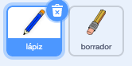

## Haz un lápiz

Comienza haciendo un lápiz que puedes utilizar para dibujar en un Escenario.

--- task ---

Abre el proyecto inicial de Scratch 'Caja de lápices'.

**Online**: abre el proyecto de inicio en [scratch.mit.edu/projects/395318737](https://scratch.mit.edu/projects/395318737){:target="_blank"}

Si tienes una cuenta de Scratch puedes hacer una copia haciendo clic en **Reinventar**.

**Offline**: abre el [proyecto de inicio](https://rpf.io/p/es-LA/paint-box-go){:target=_blank"} en el editor offline.

Si necesitas descargar e instalar el editor offline de Scratch, puedes encontrarlo en [rpf.io/scratchoff](https://rpf.io/scratchoff){:target="_blank"}

En el proyecto de inicio, deberías ver los objetos lápiz y borrador:



--- /task ---

--- task ---

Añadir la extensión de lápiz a tu proyecto.

[[[generic-scratch3-add-pen-extension]]]

--- /task ---

--- task ---

Añade algo de código al objeto lápiz para hacer que el objeto siga al cursor `por siempre`{:class="block3control"} así puedes dibujar:


```blocks3
when flag clicked
por siempre 
  ir a (mouse pointer v)
end
```

--- /task ---

--- task ---

Haz clic en la bandera y luego mueve el puntero del ratón alrededor del Escenario para probar si tu código funciona.

--- /task ---

Luego, haz que tu lápiz sólo dibuje `si`{:class="block3control"} se mantiene presionado el botón del ratón.

--- task ---

Añade este código a tu objeto lápiz:


```blocks3
when flag clicked
forever
  go to (mouse pointer v)
+ if <mouse down?> then
  pen down
  else
  pen up
end
```

--- /task ---

--- task ---

Vuelve a probar tu código. Esta vez, mueve el lápiz alrededor del Escenario y mantén presionado el botón del ratón. ¿Puedes dibujar con tu lápiz?


--- /task ---

--- collapse ---
---
title: ¿Tu lápiz no dibuja desde la punta?
---

Si la línea que tu lápiz dibuja parece que sale desde el medio del lápiz, necesitas cambiar tu objeto lápiz de modo que la punta sea el centro del objeto.

Haz clic sobre el objeto lápiz, y luego haz clic sobre la pestaña **Disfraces**.

Mueve el disfraz para que la punta del lápiz esté **justo encima** del centro.


Ahora mueve el lápiz alrededor del Escenario y dibuja. Ahora el lápiz debería dibujar una línea desde la punta.

--- /collapse ---
