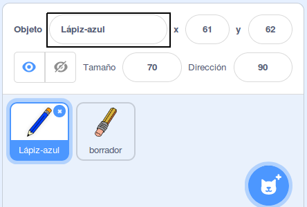
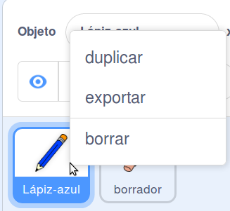
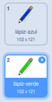
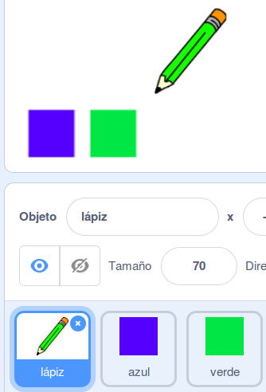

## Lápices de colores

Ahora vas a añadir diferentes lápices de colores a tu proyecto y permitir que el usuario elija entre los mismos.

\--- task \---

Cambia el nombre del objeto `lápiz` a `lápiz-azul`



\--- /task \---

\--- task \---

Haz clic derecho en el objeto lápiz-azul y duplica su disfraz.



\--- /task \---

\--- task \---

Cambia el nombre de tu nuevo disfraz a 'lápiz-verde' y cambia su color a verde.



\--- /task \---

\--- task \---

Dibuja dos objetos más - un cuadrado azul y un cuadrado verde. Estos sirven para elegir entre el lápiz azul y el verde.



\--- /task \---

\--- task \---

Renombra los nuevos objetos para que se llamen 'azul' y 'verde'

[[[generic-scratch3-rename-sprite]]]

\--- /task \---

\--- task \---

Añade algo de código al objeto ‘verde’, de modo que cuando se haga clic en este objeto, se `envíe`{:class="block3events"} el mensaje “verde”.


```blocks3
al hacer clic en este objeto
enviar (verde v)
```

[[[generic-scratch3-broadcast-message]]]

\--- /task \---

El objeto lápiz debería 'escuchar' el mensaje "verde" y cambiar su disfraz y color de lápiz en respuesta.

\--- task \---

Cambia al objeto lápiz. Añade algo de código de modo que cuando este objeto reciba el mensaje `verde`{:class="block3events"}, cambie de disfraz al lápiz verde y cambie el color del marcador a verde.


```blocks3
al recibir [verde v]
cambiar disfraz a (lápiz-verde v)
fijar color de lápiz a [#00C44]
```

Para fijar el lápiz al color verde, haz clic en el cuadrado de color en el bloque `fijar color del marcador`{:class="block3extensions"}, y luego haz clic sobre el objeto cuadrado verde.

\--- /task \---

Luego del mismo modo puedes cambiar el color del lápiz a azul.

\--- task \---

Haz clic sobre el objeto cuadrado azul y añade este código:


```blocks3
when this sprite clicked
broadcast (blue v)
```

Luego, haz clic sobre el objeto lápiz y añade este código:


```blocks3
when I receive [blue v]
switch costume to (pencil-blue v)
set pen color to [#0000ff]
```

\--- /task \---

\--- task \---

Finalmente, añade este código para indicarle al objeto lápiz con qué color comenzar, y asegurarte de que la pantalla esté limpia cuando comiences.


```blocks3
when flag clicked
+erase all
+switch costume to (pencil-blue v)
+set pen color to [#0035FF]
forever
  go to (mouse pointer v)
if <mouse down?> then
  pen down
  else
  pen up
end
```

\--- /task \---

Si prefieres, puedes comenzar con un lápiz de diferente color.

\--- task \---

Prueba tu código. ¿Puedes cambiar entre los colores de lápices azul y verde al hacer clic sobre los objetos cuadrado azul o verde?


\--- /task \---