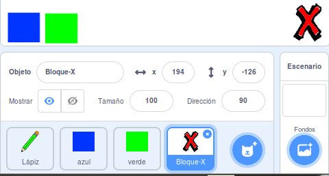
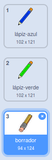

## Deshacer errores

A veces se comenten errores, así que añade un botón 'limpiar' y un botón borrador.

--- task ---

Añade el objeto ‘X-block’ desde la sección letras de la biblioteca. Colorea el disfraz del objeto rojo y hazlo más pequeño. Este objeto es el botón 'limpiar'.

[[[generic-scratch3-sprite-from-library]]]



--- /task ---

--- task ---

Añade código al objeto ‘X-block’ para limpiar el Escenario cuando se haga clic en el objeto.


```blocks3
when this sprite clicked
erase all
```

--- /task ---

No necesitas utilizar un `enviar`{:class="block3events"} para limpiar el Escenario, porque el bloque `borrar todo`{:class="block3extensions"} cumple con esa función.

¿Ves que el objeto lápiz incluye un disfraz de borrador?



Tu proyecto también incluye un objeto borrador por separado.

--- task ---

Haz clic derecho en este objeto borrador y luego haz clic en **mostrar**. Aquí está cómo debería quedar el Escenario ahora:


--- /task ---

--- task ---

Añade código al objeto borrador para mandar el mensaje `enviar 'borrador'`{:class="block3events"} cuando se haga clic en el objeto borrador.


```blocks3
when this sprite clicked
broadcast (borrador v)
```

--- /task ---

Cuando el objeto lápiz reciba el mensaje 'borrador', ¡debería cambiar su disfraz al de borrador y cambiar el color del marcador a blanco, ¡que es el mismo color que el Escenario!

--- task ---

Añade algo de código para crear el borrador.

--- hints ---
 --- hint ---

Añade algo de código al objeto lápiz: `al recibir`{:class="block3events"} el mensaje `borrador`{:class="block3events"} `cambiar disfraz a borrador`{:class="block3looks"} `Fijar color de lápiz`{:class="block3extensions"} a blanco

--- /hint --- --- hint ---

Aquí están los bloques que necesitas:

```blocks3
set pen color to [#FFFFFF]
when I receive [borrador v]

switch costume to (borrador v)
```

--- /hint --- --- hint ---

Así es como debe verse tu código:


```blocks3
when I receive [borrador v]
switch costume to (borrador v)
set pen color to [#FFFFFF]
```

--- /hint ------ /hints --- --- /task ---

--- task ---

Prueba tu proyecto para ver si puedes borrar en el escenario y limpiarlo del todo.


--- /task ---

Hay otro problema más con el lápiz: puedes dibujar donde sea en el Escenario, incluyendo el espacio cerca de los botones 'limpiar' y borrar!


--- task ---

Para arreglar esto, cambia el código de modo que el lápiz esté abajo sólo si se hace clic en el ratón **y** la posición `y` del cursor sea mayor que `-120`:


```blocks3
when flag clicked
erase all
switch costume to (lápiz-azul v)
set pen color to [#0035FF]
forever
  go to (puntero del ratón v)
+if <<mouse down?> and <(mouse y) > [-120]>> then 
  pen down
  else
  pen up
end
```

--- /task ---

--- task ---

Prueba tu proyecto. Ahora no deberías ser capaz de dibujar cerca de los botones.


--- /task ---