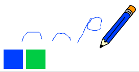

## Undo mistakes

Sometimes mistakes happen, so add a 'clear' button and an eraser button.

\--- task \--- Añade el objeto 'X-block' desde la sección de letras de biblioteca. Colorea el disfraz de objeto de rojo y hazlo más pequeño. Este objeto es el botón 'limpiar'.

[[[generic-scratch3-sprite-from-library]]]

 \--- /task \---

\--- task \--- Añade código al objeto 'X-block' para limpiar el Escenario cuando se haga clic en el objeto.


```blocks3
when this sprite clicked
erase all
```

\--- /task \---

No es necesario utilizar un `broadcast`{:class="block3events"} para limpiar un Escenario, porque el bloque `erase all`{:class="block3extensions"} cumple esa función.

¿Ves que el objeto lápiz incluye un disfraz de borrador?


Tu proyecto también incluye un objeto goma de borrar aparte.

\--- task \--- Haz clic con el botón derecho sobre el objeto borrador y luego haz clic sobre **show**. Aquí está cómo debería quedar el Escenario ahora:

 \--- /task \---

Añade código al objeto borrador para enviar un `'eraser' broadcast`{:class="block3events"} cuando se hace clic en el objeto borrador.


```blocks3
when this sprite clicked
broadcast (eraser v)
```

\--- /task \---

Cuando el objeto lápiz reciba el mensaje 'borrador', ¡debería cambiar su disfraz al de borrador y cambiar el color del marcador a blanco, que es el mismo color que el Escenario!

\--- task \--- Añade algo de código para crear el borrador.

\--- hints \--- \--- hint \--- Añade algo de código al objeto lápiz: `When I receive`{:class="block3events"} el mensaje `eraser`{:class="block3events"} `Switch to costume erase`{:class="block3looks"} `Set pen color`{:class="block3extensions"} a blanco \--- /hint \--- \--- hint \--- Aquí están todos los bloques que necesitas:

```blocks3
set pen color to [#FFFFFF]
when I receive [eraser v]

switch costume to (eraser v)
```

\--- /hint \--- \--- hint \--- Aquí está cómo debería lucir el código: 

```blocks3
when I receive [eraser v]
switch costume to (eraser v)
set pen color to [#FFFFFF]
```

\--- /hint \--- \--- /hints \--- \--- /task \---

\--- task \--- Prueba tu proyecto para ver si puedes limpiar el Escenario y borrar las líneas del lápiz.

 \--- /task \---

Hay otro problema más con el lápiz: puedes dibujar donde sea en el Escenario, incluyendo el espacio cerca de los botones 'limpiar' y borrar!


\--- task \--- Para arreglar esto, cambia el código de modo que el marcador esté abajo sólo si se hace clic en el ratón **and** la posición del cursor `and` es mayor que `-120`:


```blocks3
when flag clicked
erase all
switch costume to (pencil-blue v)
set pen color to [#0035FF]
forever
  go to (mouse pointer v)
+if <<mouse down?> and <(mouse y) > [-120]>> then 
  pen down
  else
  pen up
end
```

\--- /task \---

\--- task \--- Prueba tu proyecto. Ahora no deberías ser capaz de dibujar cerca de los botones.

 \--- /task \---