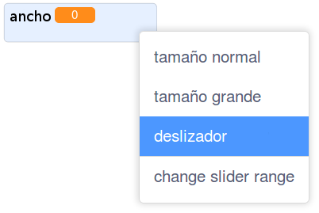
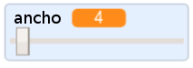

## Cambiar el ancho del marcador

Luego vas a añadir código para permitir que el usuario de tu programa dibuje cosas con diferentes grosores de marcador.

\--- task \--- Primero, añade una nueva variable llamada `width`{:class="block3variables"}.

[[[generic-scratch3-add-variable]]] \--- /task \---

\--- task \--- Añade esta línea **inside** del bucle `forever`{:class="block3control"} del código del objeto lápiz:

```blocks3
when flag clicked
erase all
switch costume to (pencil-blue v)
set pen color to [#0035FF]
forever
go to (mouse pointer v)
+set pen size to (width :: variables)
if <<mouse down?> and <(mouse y) > [-120]>> then 
  pen down
  else
  pen up
end
```

\--- /task \---

El ancho del marcador ahora se vuelve repetidamente del valor de la variable `width`{:class="block3variables"}.

\--- task \--- Haz clic a la derecha de la variable `width`{:class="block3variables"} que se muestra en el Escenario, y luego haz clic en **slider**.

 \--- /task \---

Ahora puedes arrastrar el deslizador que se ve debajo de la variable para cambiar el valor de la misma.



\--- task \--- Prueba tu proyecto y mira si puedes añadir código para ajustar el ancho del marcador.

 \--- /task \---