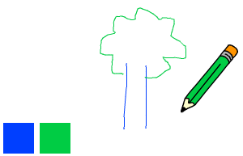

## Värvilised pliiatsid

Nüüd lisate oma projektile erinevad värvilised pliiatsid ja lubate kasutajal valida nende vahel.

\--- ülesanne \--- Klõpsake pliiatsilõõtsale, klõpsa **kostüümile**ja kopeerige „pliiats-sinine” kostüüm.

 \--- / ülesanne \---

\--- ülesanne \--- Nimetage uus kostüüm „pliiats-roheline” ja värvige pliiats roheliselt.


\--- / ülesanne \---

\--- ülesanne \--- Joonistage kaks uut spritet: üks sinine ruut ja üks roheline ruut. Need on sinise ja rohelise pliiatsi valimiseks.

 \--- / ülesanne \---

\--- ülesanne - Uute spritide ümbernimetamine, et neid nimetataks sinine ja roheline

[[[generic-scratch3-rename-sprite]]]

\--- / ülesanne \---

\--- ülesanne \--- Lisage „rohelisele” sprite'ile mõni kood, nii et kui see spriit on klõpsatud, siis saadab see ``:: class = "block3events"} sõnumi "green".


```blocks3
kui see sprite klõpsas
ülekannet (roheline v)
```

[[[generic-scratch3-broadcast-message]]] \--- / ülesanne \---

Pliiatsil on vaja kuulata "rohelist" sõnumit ning muuta oma kostüümi ja pliiatsivärvi vastuseks.

\--- ülesanne \--- Lülitage pliiatsipildile. Lisage mõni kood nii, et kui see sprite saab eetrisse `rohelist`{: class = "block3events"}, lülitub see rohelisele pliiatsile ja muudab pliiatsi värvi roheliseks.


```blocks3
kui ma saan [roheline v]
lüliti kostüüm (pliiats-roheline v)
seadistatud pliiatsivärv [# 00CC44]
```

Et pliiats värviks roheliseks, klõpsa värvi ruudule `set pen color`{: class = "block3extensions} plokis ja seejärel klõpsake rohelisel ruudul. \--- / ülesanne \---

Siis sarnase asjaga, et saaksite pliiatsivärvi siniseks muuta.

\--- ülesanne \--- Klõpsake sinist ruudu ja lisage see kood:


```blocks3
kui see sprite klõpsas
ülekannet (sinine v)
```

Seejärel klõpsa pliiatsilõõtsale ja lisage see kood: 

```blocks3
kui ma saan [sinine v]
lüliti kostüüm (pliiats-sinine v)
seadistatud pliiatsi värviks [# 0000ff]
```

\--- / ülesanne \---

\--- ülesanne - Lõpuks lisage see kood, et öelda pliiatsile, millist värvi alustada, ja veenduge, et ekraan on selge, kui teie programm käivitub.


```blocks3
kui lipu klõpsatud
+ kustutab kõik
+ lüliti kostüüm (pliiats-sinine v)
+ sulg värvi [# 0035FF]
igavesti
  Mine (hiirekursori v)
kui <mouse down?> siis
  pen alla
  teine
  pen üles
lõpp
```

\--- / ülesanne \---

Soovi korral võite alustada erineva värvi pliiatsiga.

\--- ülesanne - Testige oma koodi. Kas saate sinise või rohelise pliiatsivärvi vahel liikuda sinise või rohelise ruudu klõpsates?

 \--- / ülesanne \---