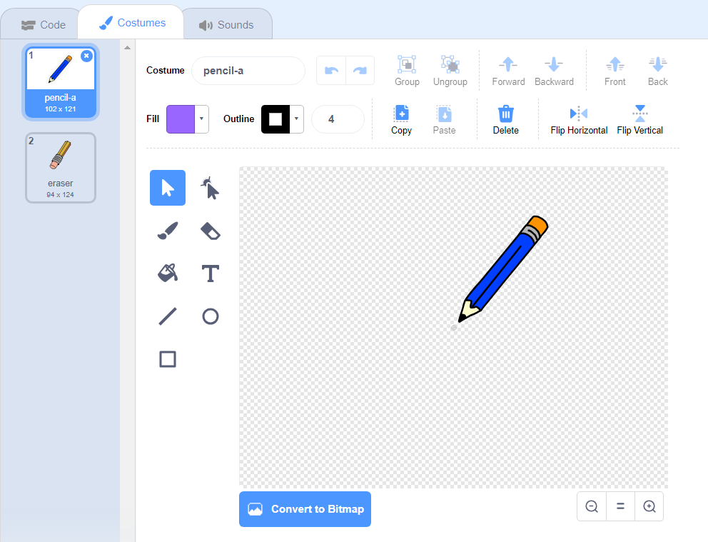

## Kynän valmistaminen

Aloitetaan tekemällä lyijykynä, jota voidaan käyttää lavalle.

+ Avaa PaintBox-projekti verkossa osoitteessa [jumpto.cc/paint-go](http://jumpto.cc/paint-go){: target = "_ blank"} tai lataa <http://jumpto.cc/paint-get>{: target = "_ blank"} ja avaa se sitten, jos käytät offline-editoriä.

Näet lyijykynä- ja pyyhekumi-spritit:


+ Lisää koodi kynän spriteeseen, jotta se seuraisi hiiren `ikuisesti`{: class = "blockcontrol"} niin, että voit piirtää:

```blocks
    kun lippu klikataan ikuisesti, siirry [hiiren osoitin v] loppuun
```

+ Napsauta lippua ja siirrä sitten hiirtä vaiheen ympäri testataksesi, toimiiko koodi.

Seuraavaksi laitetaan kynä vain piirtää `, jos`{: class = "blockcontrol"} on napsauttanut hiirtä.

+ Lisää tämä koodi pencil sprite:


+ Testaa koodi uudelleen. Tällä kertaa siirrä lyijykynä lavan ympärille ja pidä hiiren painiketta alhaalla. Voitko piirtää kynälläsi?


## \--- romahdus \---

## title: Jos sinulla on ongelmia ...

Jos kynäsi näyttää piirtävän viivaa kynän keskeltä pikemminkin kuin kärjen sijaan, sinun on vaihdettava pukukeskus.



Lyijykynä on sijoitettava **alle** lyijykynän kärkeen, ei kynän kärkeen.

Sprite'n "pukukeskukseen" tehtyjä muutoksia ei rekisteröidä, ennen kuin toinen välilehti napsautetaan, joten klikkaa toista pukua tai viimeistele muutokset pukupuhelimeen Skriptit-välilehdessä.

\--- / romahdus \---