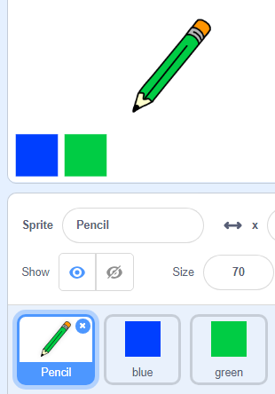

## Värikynät

Lisätään projektin eri värikynät ja annamme käyttäjän valita niiden välillä.

+ Napsauta kynän sprite, napsauta "Puvut" ja kopioi kynänsininen puku.


+ Nimeä uusi puku "kynänvihreä" ja väritä kynänvihreä.


[[[generic-scratch-rename-sprite]]]

+ Piirrä kaksi uutta sprites - yksi sininen neliö ja yksi vihreä neliö. Käytät näitä valitaksesi sinisen tai vihreän kynän.



+ Nimeä nuolet uudelleen niin, että niitä kutsutaan "siniseksi" ja "vihreiksi"

+ Lisää koodi "vihreään" spriteeseen niin, että kun sitä napsautetaan, `lähettää`{: class = "blockevents"} viestin "vihreä" kynän spriteille ja kertoo sen muuttavan puku- ja lyijykynän väriä.


[[[generic-scratch-broadcast-message]]]

+ Vaihda kynän spriteeseen. Lisää jonkinlainen koodi niin, että kun tämä sprite saa `lähetyksen`{: class = "blockevents"} vihreällä, sen pitäisi vaihtaa vihreä kynän puku ja vaihtaa kynän väri vihreäksi.


Jos haluat asettaa kynän väriksi vihreiksi, napsauta värillistä laatikkoa `setin kynänvärillä`{: class = "blockpen"} ja napsauta vihreää spriteä valitsemalla sama väri vihreä kuin kynän väri.

+ Nyt voit tehdä saman sinisen kynän kuvakkeen: lisää tämä koodi siniselle neliön sprite:

```blocks
kun tämä sprite napsautti lähetystä [sininen v]
```

... ja lisää tämä koodi pencil sprite:

```blocks
kun saan [sininen v] kytkin puku [kynänsininen v] asetettu kynän väri [# 0000ff]
```

+ Lopuksi, lisää tämä koodi ilmoittamaan kynän sprite, joka väri alkaa ja varmista, että näyttö on selvä.


Päätimme aloittaa sinisellä, mutta jos haluat, voit aloittaa eri värikynällä.

+ Testaa projektisi. Voitko vaihtaa sinisiä ja vihreitä kynää napsauttamalla sinisiä tai vihreitä neliölehtiä?

