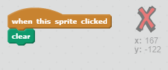

## Tekee virheitä

Joskus tapahtuu virheitä, joten lisätään "selvä" -painike ja pyyhekumi.

+ Lisää "X-blokki" sprite - löydät sen kirjastosta kirjainosassa. Väri puku punaisella. Tästä tulee "selkeä" -painike.


+ Lisää koodi tähän spriteeseen tyhjentääksesi vaiheen, kun sitä napsautetaan.



Huomaa, että sinun ei tarvitse lähettää viestiä tyhjentääksesi vaiheen, voit käyttää selkeää estettä tästä spriteestä.

Olet todennäköisesti huomannut, että kynän spriteesi sisältää pyyhekumispuvun:


+ Hankkeeseesi kuuluu myös erillinen pyyhekumi sprite. Napsauta hiiren oikealla painikkeella tätä painiketta ja valitse Näytä. Tässä vaiheessa sinun vaiheesi pitäisi näyttää:


+ Lisää koodi pyyhekumi sprite, kertoa kynä vaihtaa pyyhekumi, kun sprite on napsautettu.


Kun kynä vastaanottaa "pyyhekummerin" viestin, voit vaihtaa kynän puku pyyhekumiin ja vaihtaa kynän värin valkoiseksi - samaa väriä kuin lavalla!

+ Lisää muutama koodi luomaan pyyhekumi

\--- vinkit \--- \--- vinkka \--- Lisää koodi kynän sprite: **Kun saan** **pyyhekumi** viesti **Vaihda puku** pyyhekumi **Aseta kynän väri** valkoiseksi \--- / hint \--- \--- vinkki \--- Tässä on, miten koodi kynän sprite pitäisi näyttää:

```blocks
kun saan [pyyhekumi v] vaihtaa puku [pyyhekumi v] asettaa kynän värin [#FFFFFF]
```

\--- / hint \--- \--- / vinkit \---

+ Testaa projekti ja katso, voitko poistaa ja poistaa vaiheessa.


Kynällä on vielä yksi ongelma - voit piirtää missä tahansa lavalla, mukaan lukien valikoiva kuvakkeet lähellä!


Voit korjata tämän ilmoittamalla kynällä vain piirtää, jos hiiren napsautetaan *ja* , jos hiiren y-sijainti on suurempi kuin -120:


+ Testaa projektisi; sinun ei pitäisi nyt päästä lähelle valintalohkoja.

