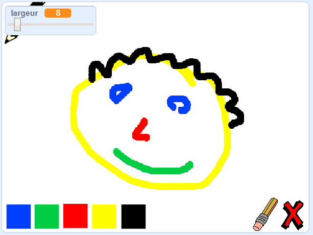

\--- no-print \---

This is the **Scratch 3** version of the project. There is also a [Scratch 2 version of the project](https://projects.raspberrypi.org/en/projects/paint-box-scratch2).

\--- /no-print \---

## Introduction

Dans ce projet, Tu vas créer ton propre programme de peinture !

### Ce que tu feras

\--- no-print \--- Click on the green flag to start. Use the mouse to move the pencil, and hold down the left mouse button to draw. Click on a colour to change pencils. Click on the eraser to change to it, and use it to erase your work. To clear the page, click on the cross.

  <iframe allowtransparency="true" width="485" height="402" src="//scratch.mit.edu/projects/embed/267243161/?autostart=false" frameborder="0" scrolling="no"></iframe>
  

\--- /no-print \---

\--- print-only \--- You will click on the green flag to start, and you'll use the mouse to move the pencil and hold down the left mouse button to draw. Clicking on a colour will change pencil colours, and clicking on the eraser will change to the eraser!

 \--- /print-only \---

## \--- collapse \---

## title: Ce que tu vas apprendre

+ Add the pen extension in Scratch
+ Use broadcasts to control a sprite in Scratch
+ Recall how to respond to mouse events in Scratch \--- /collapse \---

## \--- collapse \---

## title: Ce qu'il faut avoir

### Matériel informatique

+ Un ordinateur capable d'exécuter Scratch 3

### Logiciels

+ Scratch 3 ( [en ligne](http://rpf.io/scratchon) ou [hors ligne](http://rpf.io/scratchoff)")

### Downloads

+ [Offline starter project](http://rpf.io/p/en/paint-box-go){:target="_blank"}

Question

## \--- collapse \---

## title: Additional information for educators

Si tu as besoin d'imprimer ce projet, merci d'utiliser la [Version imprimable](https://projects.raspberrypi.org/en/projects/paint-box/print) {: target = "_ blank"}.

You can [find the solution for this project here](http://rpf.io/p/en/paint-box-get){:target="_blank"}. \--- /collapse \---