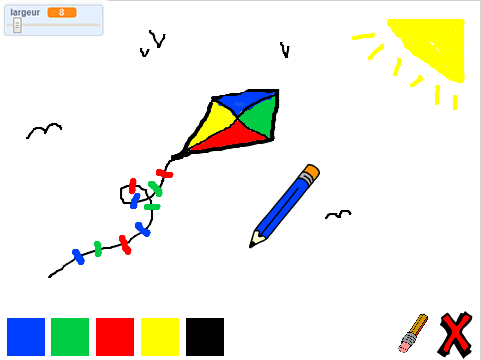

## Introduction

Dans ce projet, vous allez créer votre propre programme de peinture !

### Qu'allez-vous faire

Cliquez sur le drapeau vert pour démarrer. Utilisez la souris pour bouger le crayon et maintenez le bouton gauche enfoncé pour dessiner. Cliquez sur une couleur pour changer de crayon ou cliquez sur la gomme et utilisez la pour effacer votre travail. Pour effacer la page, cliquez sur la croix.

  <iframe allowtransparency="true" width="485" height="402" src="https://scratch.mit.edu/projects/embed/63473366/?autostart=false" frameborder="0"></iframe>
  

### Qu'allez-vous apprendre

Ce projet couvre des éléments des sections suivantes du [Raspberry Pi Digital Making Curriculum](http://rpf.io/curriculum){: target = "_ blank"}:

+ [Combine programming constructs to solve a problem.](https://www.raspberrypi.org/curriculum/programming/builder){:target="_blank"}

### Additional information for educators

If you need to print this project, please use the [printer friendly version](https://projects.raspberrypi.org/en/projects/paint-box/print){:target="_blank"}.

Use the link in the footer to access the GitHub repo for this project, which contains all resources (including an example finished project) in the 'en/resources' folder.