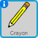
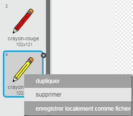
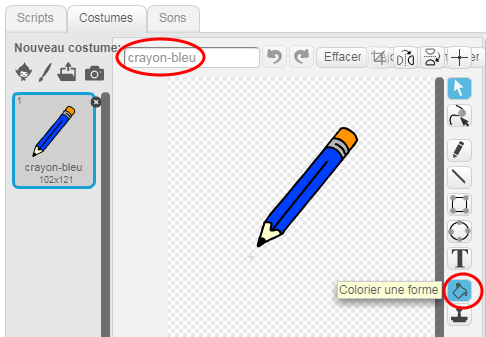
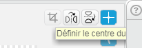
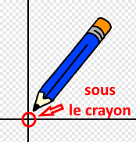

## Fabrication d'un crayon

Commençons par créer un crayon qui peut être utilisé pour dessiner sur la scène.

+ Commencez un nouveau projet de Scratch et supprimez le lutin de chat pour que votre projet soit vide. Vous pouvez trouver l'éditeur de scratch en ligne à <a href="http://jumpto.cc/scratch-new">jumpto.cc/scratch-new</a>.

+ Ajoutez le lutin de crayon à votre projet.

	

+ Cliquez sur 'Costumes', et supprimez le costume 'Crayon-b'.

	

+  Renommez votre costume 'crayon bleu' et utilisez l'outil 'Colorier une forme' pour faire le crayon bleu.

	

+ Comme vous utiliserez la souris pour dessiner, vous voudrez que le crayon suive la souris `répéter indéfiniment` {.blockcontrol}. Ajoutez ce code à votre lutin de crayons :

	```blocks
		quand le drapeau vert pressé
		répeter indéfiniment
		  aller à [mouse pointer v]
		end
	```

+ Testez ce code en cliquant du drapeau et déplacez ensuite la souris autour de l'étape. Marche-t-il comme vous le souhaitez ?

+ Avez-vous remarqué que c'est le centre du crayon et non la pointe qui suit l'indicateur de souris ?

	

	Pour fixer ceci, cliquez sur le costume ' crayon Bleu ' de votre lutin de crayon et cliquez sur ' Définir le centre du costume '.

	

+ Vous devriez remarquer qu'un viseur apparaît sur le costume. Vous pouvez maintenant cliquer juste au-dessous du bout du crayon et mettre ce point comme le centre du costume.

	

+ Cliquez sur l'onglet ' Scripts ' et testez ensuite votre crayon de nouveau - fonctionne-t-il mieux qu'auparavant ?

+ Ensuite, dessinons avec votre crayon `si` {.blockcontrol} la souris a été cliquée. Ajoutez ce code à votre lutin de crayon :

	

+ Testez votre code de nouveau. Cette fois, bougez le crayon autour de l'étape en appuyant sur le bouton de souris. Pouvez-vous dessiner avec votre crayon ?

	


