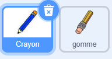
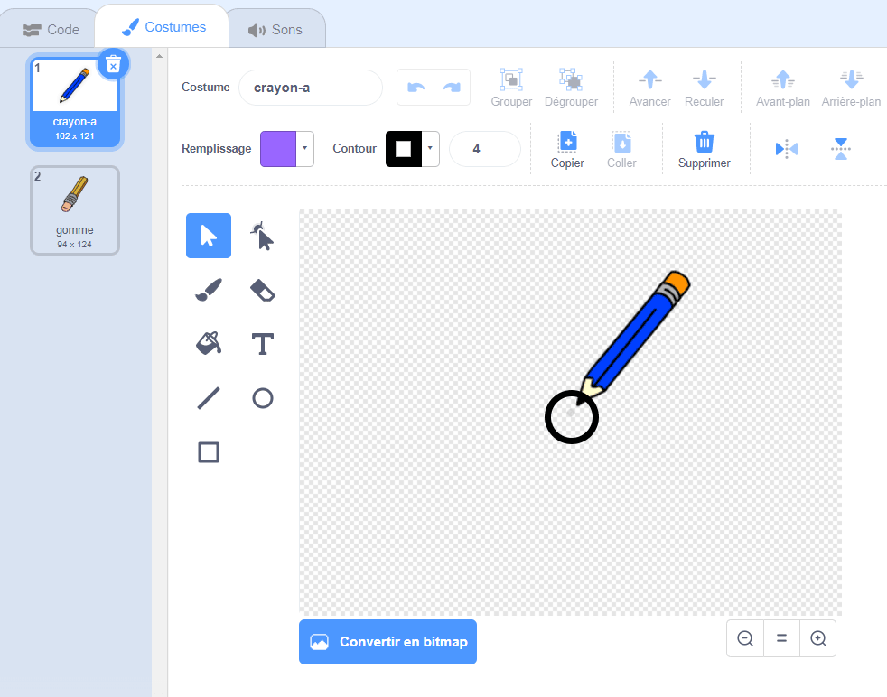

## Crée un crayon

Commence par fabriquer un crayon que tu pourras utiliser pour dessiner sur la scène.

\--- task \--- Ouvre le projet de démarrage Scratch 'Palette de peinture'.

**En ligne**: ouvre le projet de démarrage à [rpf.io/paint-box-on](http://rpf.io/paint-box-on){:target="_blank"}

Si tu as un compte Scratch, tu peux en créer une copie en cliquant sur **Remix**.

**Hors ligne**: ouvre le [projet de démarrage](http://rpf.io/p/en/paint-box-go){:target="_blank"} dans l'éditeur hors ligne.

Si tu dois télécharger et installer l'éditeur hors ligne Scratch, tu peux le trouver à [rpf.io/scratchoff](http://rpf.io/scratchoff){:target="_blank"}

Dans le projet de démarrage, tu devrais voir des sprites crayon et gomme:

 \--- /task \---

\--- task \---

Ajoute l'extension Crayon à ton projet.

[[[generic-scratch3-add-pen-extension]]]

\--- /task \---

\--- task \---

Ajoute un peu de code au sprite crayon pour que celle-ci suive le pointeur de la souris `pour toujours`{:class="block3control"} afin que tu puisses dessiner:


```blocks3
lorsque le drapeau est cliqué
répéter indéfiniment
  aller à (pointeur de souris v)
fin
```

\--- /task \---

\--- task \--- Clique sur le drapeau, puis déplace le pointeur de la souris sur la scène pour vérifier si ton code fonctionne. \--- /task \---

Ensuite, fais que ton crayon ne dessine que `si`{:class="block3control"} le bouton de la souris est cliqué.

\--- task \--- Ajoute ce code à ton sprite crayon:


```blocks3
lorsque le drapeau est cliqué
répéter indéfiniment
  aller à (pointeur de la souris v)

+ si <mouse down?> alors
  stylo en position d'écriture
  sinon
  relever le stylo
fin
```

\--- /task \---

\--- tâche \--- Teste à nouveau ton code. Cette fois, déplace le crayon sur la scène et maintiens le bouton de la souris enfoncé. Peux-tu dessiner avec ton crayon ?

 \--- /task \---

## \--- collapse \---

## title: Est-ce que ton crayon ne dessine pas au niveau de sa pointe?

Si le trait dessiné par ton crayon semble provenir du centre du crayon, tu dois changer le sprite du crayon de manière à ce que son extrémité figure au centre du sprite.

Clique sur le sprite crayon, puis sur l'onglet **Costumes**.

Déplace le costume pour que la pointe du crayon soit **juste au-dessus** du centre.



Maintenant, déplace le crayon sur la scène et dessine. Le crayon doit maintenant tracer une ligne à partir de son extrémité.

\--- /collapse \---