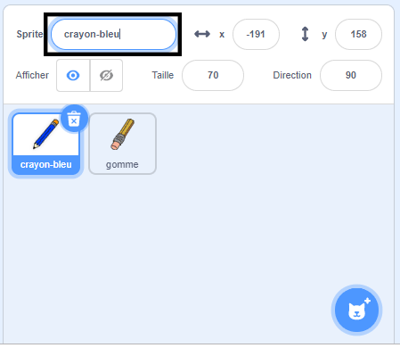
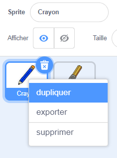
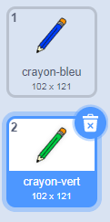
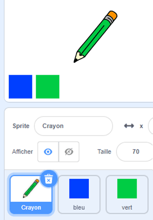

## Crayons de couleurs

Tu vas maintenant ajouter des crayons de couleurs différents à ton projet et permettre à l'utilisateur de les choisir.

--- task --- Renomme le costume `crayon` en `crayon bleu`

 --- /task ---

--- task --- Fait un clic droit sur le sprite crayon et duplique le costume "crayon bleu".

 --- /task ---

--- task --- Nomme le nouveau costume 'crayon-vert' et colorie le crayon en vert.



--- /task ---

--- task --- Dessine deux nouveaux sprites: un carré bleu et un carré vert. Ceux-ci sont pour choisir entre le crayon bleu et vert.

 --- /task ---

--- task --- Renomme les nouveaux sprites pour qu'ils s'appellent 'bleu' et 'vert'

[[[generic-scratch3-rename-sprite]]]

--- /task ---

--- task --- Ajoute du code au sprite 'vert' afin que, lorsque ce sprite est cliqué, il `diffuse`{:class="block3events"} le message "vert".


```blocks3
when this sprite clicked
broadcast (vert v)
```

[[[generic-scratch3-broadcast-message]]] --- /task ---

Le sprite crayon devrait écouter le message "vert" et modifier son costume et sa couleur de crayon en réponse.

--- task --- Bascule vers ton sprite crayon. Ajoute du code de sorte que lorsque ce sprite reçoit la diffusion `vert`{:class="block3events"}, il passe au costume de crayon vert et change la couleur du stylo en vert.


```blocks3
when I receive [vert v]
switch costume to (crayon-vert v)
set pen color to [#00CC44]
```

Pour permettre au crayon de colorier en vert, clique sur le carré coloré dans le bloc `définir la couleur du crayon`{:class="block3extensions"}, et ensuite clique sur le sprite carré vert. --- /task ---

Reproduis les mêmes étapes afin de pouvoir changer la couleur du crayon en bleu.

--- task --- Clique sur le sprite carré bleu et ajoute ce code:


```blocks3
quand ce sprite est cliqué 
envoyer à tous (bleu v)
```

Clique ensuite sur le sprite crayon et ajoute ce code: 

```blocks3
when I receive [bleu v]
switch costume to (crayon-bleu v)
set pen color to [#0000ff]
```

--- /task ---

--- task --- Enfin, ajoute ce code pour indiquer au sprite crayon quelle couleur avec laquelle commencer et pour t'assurer que l'écran est clair quand ton programme démarre.


```blocks3
when flag clicked
+erase all
+switch costume to (pencil-blue v)
+set pen color to [#0035FF]
forever
  go to (pointeur de souris v)
if <souris pressée ?> then 
  pen down
  else
  pen up
end
```

--- /task ---

Si tu préfères, tu peux commencer avec un crayon de couleur différente.

--- task ---

Teste ton code. Peux-tu basculer entre les couleurs de crayon bleu et vert en cliquant sur les sprites carrés bleus ou verts?

 --- /task ---
