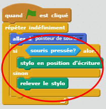
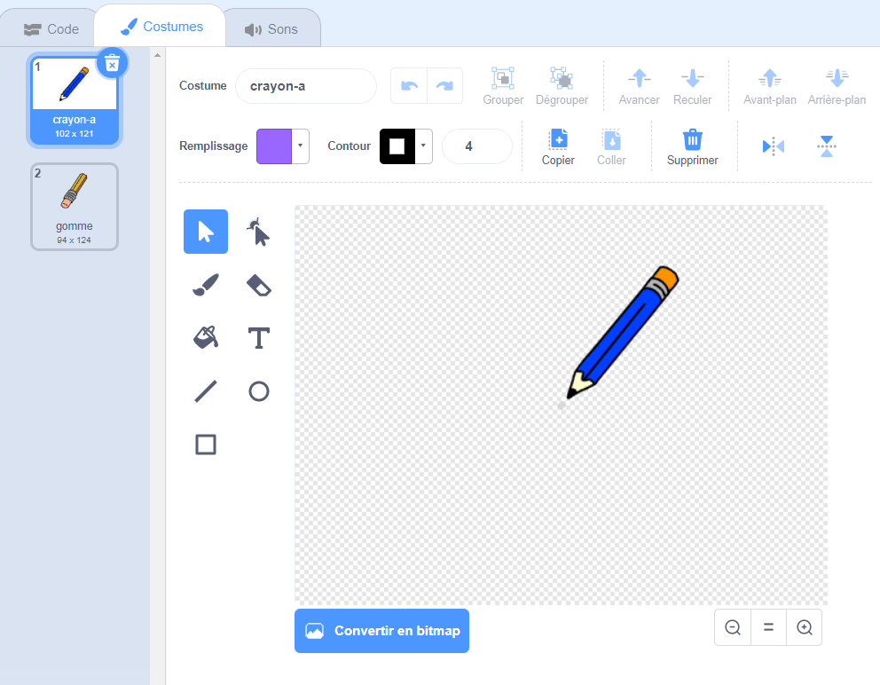

## Faire un crayon

Commençons par faire un crayon qui peut être utilisé pour dessiner sur la scène.

+ Ouvrez le projet Scratch 'Paintbox' en ligne sur [ jumpto.cc/paint-go ](http://jumpto.cc/paint-go) {: target = "_ blank"} ou téléchargez-le depuis [ http://jumpto.cc/paint-get ](http://jumpto.cc/paint-get) {: target = "_ blank"}, puis ouvrez-le si vous utilisez l'éditeur hors ligne.

Vous verrez les lutins du crayon et de la gomme :


+ Ajoutez du code au lutin du crayon pour lui faire suivre la souris ` pour toujours ` {: class = "blockcontrol"} pour que vous puissiez dessiner :

```blocks
    quand le drapeau vert pressé
répéter indéfiniment
   aller à [mouse pointer v]
fin
```

+ Cliquez sur le drapeau vert, puis déplacez la souris sur la scène pour tester si le code fonctionne.

Ensuite, faisons en sorte que votre crayon ne dessine que ` si ` {: class = "blockcontrol"} le bouton gauche de la souris est enfoncé.

+ Ajoutez ce code à votre lutin de crayon :



+ Testez votre code à nouveau. Cette fois, déplacez le crayon sur la scène et maintenez le bouton gauche de la souris enfoncé. Pouvez-vous dessiner avec votre crayon ?


## \--- collapse \---

## title: Si vous avez des problèmes ...

Si votre crayon semble dessiner depuis son milieu plutôt que de sa pointe, vous devrez changer le centre du costume.



Le réticule du crayon doit être placé ** juste en dessous ** de la pointe du crayon, pas sur la pointe du crayon.

Un changement dans le centre du costume d'un sprite n'est pas enregistré tant qu'un autre onglet n'est pas cliqué, alors cliquez sur un autre costume, ou sur l'onglet 'Scripts' pour finaliser vos changements de centre de costume.

\--- /collapse \---