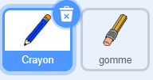

## Faire un crayon

Commençons par faire un crayon qui peut être utilisé pour dessiner sur la scène.

+ Ouvrez le projet Scratch 'Paintbox' en ligne sur [ jumpto.cc/paint-go ](http://jumpto.cc/paint-go) {: target = "_ blank"} ou téléchargez-le depuis [ http://jumpto.cc/paint-get ](http://jumpto.cc/paint-get) {: target = "_ blank"}, puis ouvrez-le si vous utilisez l'éditeur hors ligne.

Vous verrez les lutins du crayon et de la gomme :



+ Ajoutez du code au lutin du crayon pour lui faire suivre la souris ` pour toujours ` {: class = "blockcontrol"} pour que vous puissiez dessiner :

```blocks
    quand le drapeau vert pressé
répéter indéfiniment
   aller à [mouse pointer v]
fin
```

+ Cliquez sur le drapeau vert, puis déplacez la souris sur la scène pour tester si le code fonctionne.

Next, let's make your pencil only draw `if`{:class="blockcontrol"} the mouse has been clicked.

+ Add this code to your pencil sprite:


+ Test your code again. This time, move the pencil around the stage and hold down the mouse button. Can you draw with your pencil?


## \--- collapse \---

## title: If you're having problems...

If your pencil seems to be drawing the line from the middle of the pencil rather than the tip, you will need to change your costume center.


The crosshair for the pencil must be placed **just below** the tip of the pencil, not on the tip of the pencil.

A changes in a sprite's 'costume center' isn't registered until another tab is clicked, so click on another costume, or on the 'Scripts' tab to finalise your changes to the costume center.

\--- /collapse \---