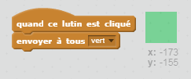

## Crayons de couleurs

Ajoutons des crayons de couleurs différentes à votre projet, et permettons à l'utilisateur de choisir entre eux.

+ Cliquez sur votre lutin crayon, cliquez sur «Costumes» et dupliquez votre costume «pencil-blue».


+ Renommez votre nouveau costume «crayon-vert» et colorez le crayon en vert.


[[[generic-scratch-rename-sprite]]]

+ Dessinez deux nouveaux lutins - un carré bleu et un carré vert. Vous les utiliserez pour sélectionner le crayon bleu ou le crayon vert.


+ Renommez vos lutins pour qu'ils soient appelés "bleu" et "vert"

+ Ajoutez du code au lutin "vert" de sorte que lorsque vous cliquez dessus, il ` diffusera ` {: class = "blockevents"} le message "vert" au lutin crayon, lui disant de changer sa couleur de costume et de stylo.



[[[generic-scratch-broadcast-message]]]

+ Passez à votre lutin crayon. Ajoutez du code afin que lorsque ce lutin reçoit le message ` ` {: class = "blockevents"} vert, il passe au costume vert et change la couleur du stylo au vert.


To set the pencil to colour to green, click the coloured box in the `set pen color`{:class="blockpen"} block, and click on the green sprite to choose the same colour green as your pencil colour.

+ You can now do the same for the blue pencil icon: add this code to the blue square sprite:

```blocks
when this sprite clicked
broadcast [blue v]
```

...and add this code to the pencil sprite:

```blocks
when I receive [blue v]
switch costume to [pencil-blue v]
set pen color to [#0000ff]
```

+ Finally, add this code to tell the pencil sprite which colour to start with, and make sure that the screen is clear.


We chose to start with blue but if you prefer, you can start with a different colour pencil.

+ Test out your project. Can you switch between blue and green pens by clicking on the blue or green square sprites?

