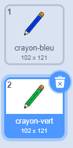
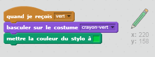
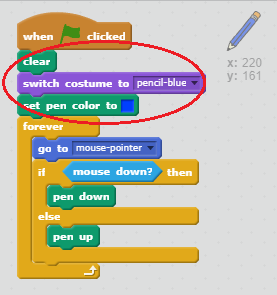

## Crayons de couleurs

Ajoutons des crayons de couleurs différentes à votre projet, et permettons à l'utilisateur de choisir entre eux.

+ Cliquez sur votre lutin crayon, cliquez sur «Costumes» et dupliquez votre costume «pencil-blue».


+ Renommez votre nouveau costume «crayon-vert» et colorez le crayon en vert.



[[[generic-scratch-rename-sprite]]]

+ Dessinez deux nouveaux lutins - un carré bleu et un carré vert. Vous les utiliserez pour sélectionner le crayon bleu ou le crayon vert.


+ Renommez vos lutins pour qu'ils soient appelés "bleu" et "vert"

+ Ajoutez du code au lutin "vert" de sorte que lorsque vous cliquez dessus, il ` diffusera ` {: class = "blockevents"} le message "vert" au lutin crayon, lui disant de changer sa couleur de costume et de stylo.


[[[generic-scratch-broadcast-message]]]

+ Passez à votre lutin crayon. Ajoutez du code afin que lorsque ce lutin reçoit le message ` ` {: class = "blockevents"} vert, il passe au costume vert et change la couleur du stylo au vert.



Pour mettre le stylo du lutin crayon en vert, cliquez sur la case de couleur dans la ` mettre la couleur du stylo ` {: class = "blockpen"} bloc, et cliquez sur le lutin vert pour choisir la même couleur verte que la couleur de votre crayon.

+ Vous pouvez maintenant faire la même chose pour le message bleu. Ajoutez ce code au lutin bleu :

```blocks
quand ce lutin est cliqué
 envoyer à tous [bleu v]
```

ajoutez ce code à votre lutin crayon :

```blocks
quand je reçois [vert v]
 basculer sur costume [crayon-vert v]
 mettre la couleur du stylo à [#00ff00
```

+ Finally, add this code to tell the pencil sprite which colour to start with, and make sure that the screen is clear.



We chose to start with blue but if you prefer, you can start with a different colour pencil.

+ Test out your project. Can you switch between blue and green pens by clicking on the blue or green square sprites?

