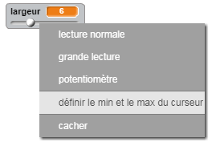

## Changement de la largeur du crayon

Permettons à l'utilisateur de dessiner grâce à l'utilisation d'une gamme de tailles différentes de crayon.

+  D'abord, ajoutez une nouvelle variable appelée 'Largeur'. Si vous ne savez pas comment faire cela, le projet 'Ballons' vous aidera.

+ Ajoutez cette ligne à l'intérieur de la boucle `répéter indéfiniment` {.blockcontrol} du code de votre crayon :

	```blocks
		choisir la taille (width) pour le stylo
	```

	Votre largeur de crayon sera maintenant mise à la valeur de votre variable 'width' à plusieurs reprises.

+ Vous pouvez changer le nombre stocké dans cette variable en cochant votre variable (dans le scripts) et avec un clic droit, choisissez 'potentiomètre'.

	

Vous pouvez maintenant bouger le curseur au-dessous de la variable pour changer sa valeur.

	

+ Testez votre projet et regardez si vous pouvez modifier la largeur de votre crayon.

	

	Si vous préférez, vous pouvez mettre la valeur minimale et maximale de 'Largeur '. Pour faire cela, faites un clic droit sur votre variable et cliquez sur ' Définir le min et le max du curseur '. Mettez les valeurs minimales et maximales de votre variable, comme 1 et 20.

	

Continuez à tester votre variable 'largeur' jusqu'à ce que vous soyez satisfaits.


