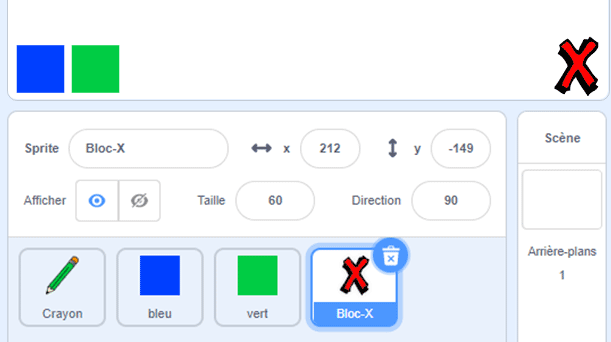
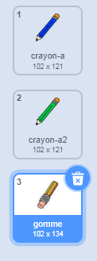

## Annule les erreurs

Parfois, des erreurs se produisent, alors ajoute un bouton "effacer" et un bouton gomme.

\--- task \--- Ajoute le sprite "Bloc-X" à partir de la section des lettres de la bibliothèque. Colorie le costume du sprite en rouge et rend-le un peu plus petit. Ce sprite est le bouton "effacer".

[[[generic-scratch3-sprite-from-library]]]

 \--- /task \---

\--- task \--- Ajoute du code au sprite "Bloc-X" pour effacer la scène lorsque tu as cliqué sur le sprite.


```blocks3
lorsque ce sprite est cliqué
effacer tout
```

\--- /task \---

Tu n'as pas besoin d'utiliser un `envoi à tous`{:class="block3events"} pour effacer la scène, car le bloc `effacer tout`{:class="block3extensions"} fait déjà cette action.

Vois-tu que le sprite crayon comprend un costume gomme?



Ton projet comprend également un sprite gomme séparé.

\--- task \--- Fait un clic droit sur ce sprite gomme, et ensuite clique sur **afficher**. Voici à quoi devrait ressembler ta scène:

 \--- /task \---

\--- task \--- Ajoute du code au sprite gomme pour envoyer un `un envoi à tous "gomme"`{:class="block3events"} lorsque le sprite gomme est cliqué.


```blocks3
lorsque ce sprite est cliqué
envoyer à tous (gomme v)
```

\--- /task \---

Lorsque le sprite crayon reçoit le message "gomme", il devrait changer son costume en gomme et changer la couleur du crayon en blanc, qui est la même couleur que la scène!

\--- task \--- Ajoute du code pour créer la gomme.

\--- hints \--- \--- hint \--- Ajoute du code au sprite crayon: `quand je reçois`{:class="block3events"} le message `gomme`{:class="block3events"} `basculer sur le costume gomme`{:class="block3looks"} `mettre la couleur du stylo`{:class="block3extensions"} sur blanc \--- /hint \--- \--- hint \--- Voici tous les blocs dont tu as besoin:

```blocks3
mettre la couleur du stylo à [#FFFFFF]
quand je reçois [gomme v]

basculer sur le costume (gomme v)
```

\--- /hint \--- \--- hint \--- Voici à quoi devrait ressembler le code: 

```blocks3
quand je reçois [gomme v]
basculer sur le costume (gomme v)
mettre la couleur du stylo à [#FFFFFF]
```

\--- /hint \--- \--- /hints \--- \--- /task \---

\--- task \--- Teste ton projet pour voir si tu peux effacer la scène et effacer les lignes au crayon.

 \--- /task \---

Il y a encore un problème avec le crayon: tu peux dessiner n’importe où sur la scène, y compris près des boutons "effacer" et gomme!


\--- task \--- Pour résoudre ce problème, modifie le code afin que le stylo soit en position d'écriture uniquement si tu cliques sur la souris **et** que la position `y` du pointeur de la souris est supérieure à `-120`:


```blocks3
lorsque le drapeau est cliqué 
effacez tout
basculer sur le costume (crayon-bleu v)
définir la couleur du stylo sur [# 0035FF]
répéter indéfiniment
  allez à (pointeur de la souris v)
+ si <<mouse down?> et <(souris y) > [-120]>> alors 
  stylo en position d'écriture
  sinon
  relever le stylo
fin
```

\--- /task \---

\--- task \--- Teste ton projet. Tu ne devrais plus pouvoir dessiner près des boutons.

 \--- /task \---