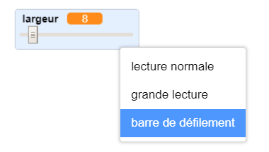
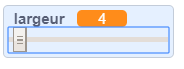
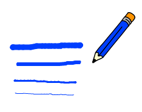

## Change la largeur du stylo

Ensuite, tu ajouteras du code pour permettre à la personne utilisant ton programme de dessiner des éléments avec différentes largeurs de stylo.

\--- task \--- Premièrement, ajoute une nouvelle variable appelée `largeur`{:class="block3variables"}.

[[[generic-scratch3-add-variable]]] \--- /task \---

\--- task \--- Ajoute cette ligne **à intérieur** de la boucle `répéter indéfiniment`{:class="block3control"} du code du sprite crayon:

```blocks3
lorsque le drapeau est cliqué 
effacer tout
basculer sur le costume (crayon-bleu v)
mettre la couleur du stylo à [# 0035FF]
répéter indéfiniment
aller à (pointeur de souris v)
+ définir la taille du stylo à (largeur :: variables)
si <<mouse down?> et <(souris y) > [-120]>> alors 
  stylo en position d'écriture
  sinon
  relever le stylo
fin
```

\--- /task \---

La largeur du stylo est maintenant définie à plusieurs reprises sur la valeur de la variable `largeur`{:class="block3variables"}.

\--- task \--- Fais un clic droit sur la variable `largeur`{:class="block3variables"} affichée sur la scène, puis clique sur **curseur**.

 \--- /task \---

Tu peux maintenant faire glisser le curseur visible sous la variable pour modifier la valeur de la variable.



\--- task \--- Teste ton projet et vois si tu peux ajouter du code pour ajuster la largeur du stylo.

 \--- /task \---