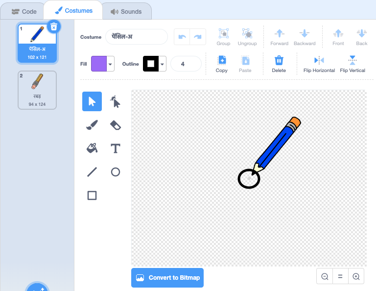

## पेंसिल बनाएं

एक पेंसिल बनाकर शुरू करें जिसका उपयोग आप स्टेज पर चित्र बनाने के लिए उपयोग कर सकते हैं।

\--- task \---

'पेंट बॉक्स' Scratch शुरूआती प्रोजेक्ट खोलें।

**Online**: open the starter project at [rpf.io/paint-box-on](https://rpf.io/paint-box-on){:target="_blank"}

यदि आपके पास एक Scratch खाता है, तो आप **Remix** पर क्लिक करके कॉपी बना सकते हैं।

**Offline**: open the [starter project](https://rpf.io/p/en/paint-box-go){:target="_blank"} in the offline editor.

If you need to download and install the Scratch offline editor, you can find it at [rpf.io/scratchoff](https://rpf.io/scratchoff){:target="_blank"}

शुरूआती प्रोजेक्ट में, आपको पेंसिल और रबड़ स्प्राइट्स दिखाई देना चाहिए:


\--- /task \---

\--- task \---

अपने प्रोजेक्ट में Pen एक्सटेंशन जोड़ें।

[[[generic-scratch3-add-pen-extension]]]

\--- /task \---

\--- task \---

पेंसिल स्प्राइट में कुछ कोड जोड़ें ताकि स्प्राइट माउस पॉइंटर का पीछा `forever`{:class="block3control"} करता रहे ताकि आप चित्र बना सकें:


```blocks3
when flag clicked
forever
  go to (mouse pointer v)
end
```

\--- /task \---

\--- task \---

झंडे पर क्लिक करें और फिर माउस को स्टेज के चारों ओर ले जाएं यह जांचने के लिए की कोड काम करता है या नहीं।

\--- /task \---

अब, यह निश्चित कीजिये की आपकी पेंसिल तभी लिखे `if`{:class="block3control"} माउस बटन क्लिक किया गया हो।

\--- task \---

इस कोड को अपने पेंसिल स्प्राइट में जोड़ें:


```blocks3
when flag clicked
forever
  go to (mouse pointer v)

+ if <mouse down?> then
  pen down
  else
  pen up
end
```

\--- /task \---

\--- task \---

अपने कोड का फिर से परीक्षण करें। इस बार, स्टेज के चारों ओर पेंसिल को ले जाएं और माउस बटन दबाए रखें। क्या आप अपनी पेंसिल से चित्र बना सकते हैं?


\--- /task \---

## \--- collapse \---

## title: क्या आपकी पेंसिल इसकी नोक से रेखा नहीं बनाती है?

अगर आपका पेंसिल बीच से रेखा बना रही है, तोह आपको अपनी पेंसिल स्प्राइट को बदलना पड़ेगा ताकि पेंसिल की नोक इस नए स्प्राइट के बीच में है।

पेंसिल स्प्राइट पर क्लिक करें, और फिर **Costumes** टैब पर क्लिक करें।

पोशाक को खिसकाएं ताकि आपकी पेंसिल की नोक पेंसिल के बीच से **सिर्फ तोड़ा ऊपर** हो।



अब स्टेज पर पेंसिल को घुमाएँ और ड्रा करें। पेंसिल को अब अपने सिरे से एक रेखा खींचनी चाहिए।

\--- /collapse \---