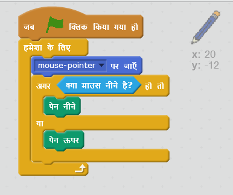

## पेंसिल बनाना

आइए एक पेंसिल बनाकर शुरू करें जिसका उपयोग स्टेज पर खींच कर बनाने(draw) के लिए किया जा सकता है।

+ 'पेंटबॉक्स' स्क्रैच प्रोजेक्ट को ऑनलाइन इससे [jumpto.cc/paint-go](http://jumpto.cc/paint-go){:target="_blank"} खोलें या इससे डाउनलोड करें <http://jumpto.cc/paint-get>{:target="_blank"} और फिर यदि आप ऑफ़लाइन संपादक का उपयोग कर रहे हैं तो इसे खोलें।

आप पेंसिल और रबड़ स्प्राइट्स देखेंगे:


+ `हमेशा के लिए(forever)` {: class = "blockcontrol"} पालन करने के लिए पेंसिल स्प्राइट में कुछ कोड जोड़ें ताकि आप खींच कर बना(draw) सकें:

```blocks
    जब झंडा क्लिक किया जाए
    forever
      go to [mouse pointer v]
    end
```

+ Click the flag and then move the mouse around the stage to test whether the code works.

Next, let's make your pencil only draw `if`{:class="blockcontrol"} the mouse has been clicked.

+ Add this code to your pencil sprite:



+ Test your code again. This time, move the pencil around the stage and hold down the mouse button. Can you draw with your pencil?


## \--- collapse \---

## title: If you're having problems...

If your pencil seems to be drawing the line from the middle of the pencil rather than the tip, you will need to change your costume center.


The crosshair for the pencil must be placed **just below** the tip of the pencil, not on the tip of the pencil.

A changes in a sprite's 'costume center' isn't registered until another tab is clicked, so click on another costume, or on the 'Scripts' tab to finalise your changes to the costume center.

\--- /collapse \---