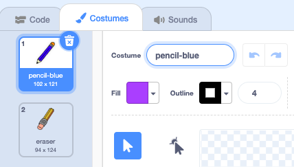

## रंगीन पेंसिलें

अब आप कई अलग रंगो के पेंसिल आपने प्रोजेक्ट में जोड़ेंगे और आप अब यूजर को उन में से एक चुननेका अनुमति देंगे।

\--- task \---

`pencil` स्प्राइट के नाम को `pencil-blue` में बदलें।



\--- /task \---

\--- task \---

Pencil स्प्राइट पर राइट क्लिक करें, और 'pencil-blue' कॉस्ट्यूम को duplicate(नकल) करें।


\--- /task \---

\--- task \---

नई कॉस्ट्यूम को 'pencil-green' नाम दें, और पेंसिल को हरा रंग दें।


\--- /task \---

\--- task \---

दो नए स्प्राइट ड्रॉ करें: एक नीला चौकोर और एक हरा चौकोर। ये नीले और हरे रंग की पेंसिल के बीच चुनने के लिए हैं।


\--- /task \---

\--- task \---

नए स्प्राइट का नाम 'blue' और 'green' में बदलें।

[[[generic-scratch3-rename-sprite]]]

\--- /task \---

\--- task \---

'green' स्प्राइट में कुछ कोड जोड़ें ताकि जब इस स्प्राइट पर क्लिक किया जाए, तो यह "green" संदेश को `प्रसारित(broadcast)`{:class="block3events"} करें।


```blocks3
when this sprite clicked
broadcast (green v)
```

[[[generic-scratch3-broadcast-message]]]

\--- /task \---

पेंसिल स्प्राइट को "green" संदेश को सुनना चाहिए और इसके प्रतिक्रिया में अपने कॉस्ट्यूम और पेंसिल के रंग को बदलना चाहिए।

\--- task \---

अपने पेंसिल स्प्राइट पर स्विच करें। अपने स्प्राइट में ऐसी कोड जोड़े ताकि जब यह स्प्राइट इस `green`{:class="block3events"} संदेश को सुनता है तब यह पेंसिल के कॉस्ट्यूम और पेन के रंग को हरें में बदल दें।


```blocks3
when I receive [green v]
switch costume to (pencil-green v)
set pen color to [#00CC44]
```

आपके पेंसिल के रंग को हरा बनाने के लिए, `set pen color`{:class="block3extensions"} ब्लॉक के अंदर रंगीन चौकोर पर क्लिक करे, और फिर हरे चौकोर के स्प्राइट पर क्लिक करे।

\--- /task \---

फिर आप पेंसिल को नीले रंग में भी बदल सकते है।

\--- task \---

नीले चौकोर के स्प्राइट पर क्लिक करें और इस कोड को जोड़ें:


```blocks3
when this sprite clicked
broadcast (blue v)
```

फिर पेंसिल स्प्राइट पर क्लिक करे और यह कोड जोड़े:


```blocks3
when I receive [blue v]
switch costume to (pencil-blue v)
set pen color to [#0000ff]
```

\--- /task \---

\--- task \---

अंत में, इस कोड को जोड़ने के लिए पेंसिल स्प्राइट को बताएं कि किस रंग से शुरू करना है, और यह सुनिश्चित करें कि आपका प्रोग्राम शुरू होने पर स्क्रीन क्लियर हो।


```blocks3
when flag clicked
+erase all
+switch costume to (pencil-blue v)
+set pen color to [#0035FF]
forever
  go to (mouse pointer v)
if <mouse down?> then
  pen down
  else
  pen up
end
```

\--- /task \---

यदि आप चाहे, तोह आप अलग रंग से भी चालू कर सकते है।

\--- task \---

अपने कोड का परीक्षण करें। क्या आप नीले या हरे रंग के चौकोर पर क्लिक करके नीले और हरे रंग के पेंसिल स्प्राइट बदल सकते हैं?


\--- /task \---