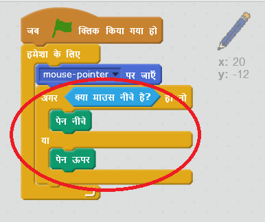

## पेंसिल बनाना

आइए एक पेंसिल बनाकर शुरू करें जिसका उपयोग स्टेज पर खींच कर बनाने(draw) के लिए किया जा सकता है।

+ 'पेंटबॉक्स' स्क्रैच प्रोजेक्ट को ऑनलाइन इससे [jumpto.cc/paint-go](http://jumpto.cc/paint-go){:target="_blank"} खोलें या इससे डाउनलोड करें <http://jumpto.cc/paint-get>{:target="_blank"} और फिर यदि आप ऑफ़लाइन संपादक का उपयोग कर रहे हैं तो इसे खोलें।

आप पेंसिल और रबड़ स्प्राइट्स देखेंगे:


+ `हमेशा के लिए(forever)` {: class = "blockcontrol"} पालन करने के लिए पेंसिल स्प्राइट में कुछ कोड जोड़ें ताकि आप खींच कर बना(draw) सकें:

```blocks
    जब झंडा क्लिक किया जाए
    forever
      go to [mouse pointer v]
    end
```

+ झंडे पर क्लिक करें और, फिर माउस को स्टेज के चारों ओर ले जाएं यह जांचने के लिए की कोड काम करता है या नहीं।

इसके बाद, चलो पेंसिल को ऐसा बनाए कि `जब` {: class = "blockcontrol"} माउस को क्लिक किया जाए तभी खींचने पर बनाए।

+ इस कोड को अपने पेंसिल स्प्राइट में जोड़ें:



+ अपने कोड का फिर से परीक्षण करें। इस बार, स्टेज के चारों ओर पेंसिल को ले जाएं और माउस बटन दबाए रखें। क्या आप अपने पेंसिल से खींच कर बना सकते हैं?


## \--- collapse \---

## title: अगर आपको समस्या आ रही हैं...

यदि आपकी पेंसिल नोक के बजाए पेंसिल के बीच से रेखा खींच रही है, तो आपको अपना पोशाक केंद्र बदलना होगा।


पेंसिल के लिए क्रॉसहेयर नोक के **ठीक नीचे** रखा जाना चाहिए, पेंसिल के नोक पर नहीं ।

स्प्राइट के 'पोशाक केंद्र' में परिवर्तन तब तक पंजीकृत नहीं होता, जब तक दूसरे टैब पर क्लिक न किया जाए। इसलिए पोशाक केंद्र के परिवर्तनों को अंतिम रूप देने के लिए, अन्य पोशाक, या 'Scripts' टैब पर क्लिक करें।

\--- /collapse \---