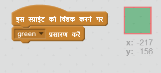
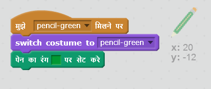

## रंगीन पेंसिलें

चलिए अपने प्रोजेक्ट में विभिन्न रंगों के पेंसिल जोड़ें, और उपयोगकर्ता को उनके बीच चुनने की अनुमति दें!

+ अपने पेंसिल स्प्राइट पर क्लिक करें, 'पोशाक' पर क्लिक करें और अपनी 'पेंसिल-नीली' पोशाक की नकल(duplicate) बनाएँ।


+ अपनी नई पोशाक 'पेंसिल-हरी' को नया नाम दें, और पेंसिल को हरे रंग में रंग दें।


[[[generic-scratch-rename-sprite]]]

+ दो नई स्प्राइट बनाएँ - एक नीला वर्ग(square) और एक हरा वर्ग। आप इनका उपयोग नीली या हरी पेंसिल चुनने के लिए करेंगे।


+ अपने sprites का पुनः नाम रखें ताकि उन्हें 'नीला' और 'हरा' कहा जाए।

+ 'हरे' स्प्राइट में कुछ कोड जोड़ें ताकि जब इसे क्लिक किया जाए, तो यह पेंसिल स्प्राइट को संदेश "हरा" `प्रसारित` {: class = "blockevents"} करें, उसे अपनी पोशाक और पेंसिल का रंग बदलने के लिए बताएं।



[[[generic-scratch-broadcast-message]]]

+ अपने पेंसिल स्प्राइट पर जाए। Add some code so that when this sprite receives the `broadcast`{:class="blockevents"} green, it should switch to the green pencil costume and change the pen colour to green.



To set the pencil to colour to green, click the coloured box in the `set pen color`{:class="blockpen"} block, and click on the green sprite to choose the same colour green as your pencil colour.

+ You can now do the same for the blue pencil icon: add this code to the blue square sprite:

```blocks
when this sprite clicked
broadcast [blue v]
```

...and add this code to the pencil sprite:

```blocks
when I receive [blue v]
switch costume to [pencil-blue v]
set pen color to [#0000ff]
```

+ Finally, add this code to tell the pencil sprite which colour to start with, and make sure that the screen is clear.


We chose to start with blue but if you prefer, you can start with a different colour pencil.

+ Test out your project. Can you switch between blue and green pens by clicking on the blue or green square sprites?

