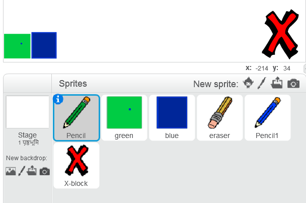

## गलतियों को पूर्ववत करें

कभी-कभी गलती हो जाती है, तो चलिए अपने प्रोजेक्ट में 'clear' बटन और रबड़ जोड़ें!

\--- task \---

लायब्रेरी के letters अनुभाग से 'X-block' स्प्राइट जोड़ें। स्प्राइट के कॉस्ट्यूम को लाल रंग जोड़े और थोड़ा छोटा बना दीजिये। यह स्प्राइट आपका 'Clear' बटन है।

[[[generic-scratch3-sprite-from-library]]]



\--- /task \---

\--- task \---

'X-block' स्प्राइट में कोड जोड़ें ताकि जब यह क्लिक किया जाए तो स्टेज साफ हो जाए।


```blocks3
when this sprite clicked
erase all
```

\--- /task \---

आपको स्टेज को साफ़ करने के लिए `broadcast`{:class="block3events"} का उपयोग करने की आवश्यकता नहीं है, क्योंकि `erase all`{:class="block3extensions"} ब्लॉक वह काम करता है।

क्या आप देखते हैं कि पेंसिल स्प्राइट में रबड़(Eraser) कॉस्ट्यूम भी शामिल है?


आपके प्रोजेक्ट में एक अलग से रबड़ स्प्राइट भी शामिल है।

\--- task \---

Click on this eraser sprite and then select **show**.


Here is how your Stage should look now:


\--- /task \---

\--- task \---

Add code to the eraser sprite to send an `'eraser' broadcast`{:class="block3events"} when the eraser sprite is clicked.


```blocks3
when this sprite clicked
broadcast (eraser v)
```

\--- /task \---

When the pencil sprite receives the 'eraser' message, it should switch its costume to the eraser and switch the pen colour to white, which is the same colour as the Stage!

\--- task \---

Add some code to create the eraser.

\--- hints \--- \--- hint \---

Add some code to the pencil sprite: `When I receive`{:class="block3events"} the `eraser`{:class="block3events"} message `Switch to costume eraser`{:class="block3looks"} `Set pen color`{:class="block3extensions"} to white

\--- /hint \--- \--- hint \---

Here are all the blocks you need:

```blocks3
set pen color to [#FFFFFF]
when I receive [eraser v]

switch costume to (eraser v)
```

\--- /hint \--- \--- hint \---

Here is what the code should look like:


```blocks3
when I receive [eraser v]
switch costume to (eraser v)
set pen color to [#FFFFFF]
```

\--- /hint \--- \--- /hints \--- \--- /task \---

\--- task \---

Test your project to see if you can clear the Stage and erase pencil lines.


\--- /task \---

There's one more problem with the pencil: you can draw anywhere on the Stage, including near the 'clear' and eraser buttons!


\--- task \---

To fix this, change the code so that the pen is only down if the mouse is clicked **and** the `y` position of the mouse pointer is greater than `-120`:


```blocks3
when flag clicked
erase all
switch costume to (pencil-blue v)
set pen color to [#0035FF]
forever
  go to (mouse pointer v)
+if <<mouse down?> and <(mouse y) > [-120]>> then 
  pen down
  else
  pen up
end
```

\--- /task \---

\--- task \---

Test your project. You now should not be able to draw near the buttons.


\--- /task \---