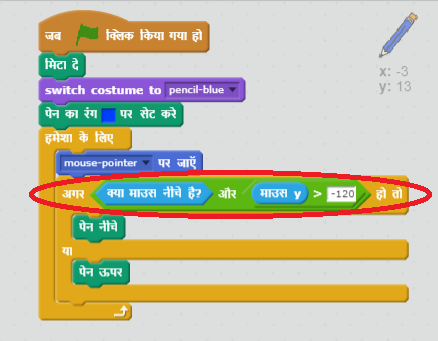

## गलतियाँ करना

कभी-कभी गलती हो जाती है, तो चलिए अपने प्रोजेक्ट में 'साफ़ करें' बटन और eraser जोड़ें!

+ 'X-block' स्प्राइट जोड़ें - आप इसे लाइब्रेरी के letters अनुभाग में पाएंगे। पोशाक को लाल में रंगे। यह 'साफ' बटन बन जाएगा।


+ इस स्प्राइट में कोड जोड़ें ताकि जब यह क्लिक किया जाए तो स्टेज साफ हो जाए।


ध्यान दें कि आपको स्टेज को साफ करने के लिए संदेश नहीं भेजना होगा, आप इस स्प्राइट से 'साफ' ब्लॉक का उपयोग कर सकते हैं।

शायद आपने ध्यान दिया होगा कि आपके पेंसिल स्प्राइट में eraser पोशाक शामिल है:


+ आपके प्रोजेक्ट में एक अलग से रबड़ स्प्राइट भी शामिल है। इस स्प्राइट पर राइट क्लिक करें और 'दिखाए(show)' चुनें। यहाँ दिखाया गया है कि कैसा आपका स्टेज दिखेगा:


+ स्प्राइट क्लिक होने पर पेंसिल को रबड़ होने के लिए रबड़ स्प्राइट में कोड जोड़ें।


जब पेंसिल को "रबड़(eraser)" संदेश प्राप्त होता है, तो आप पेंसिल पोशाक को रबड़ में बदल सकते हैं, और पेंसिल रंग को सफेद बदल सकते हैं - स्टेज के समान रंग!

+ रबड़ बनाने के लिए कुछ कोड जोड़ें

\--- hints \--- \--- hint \--- पेंसिल स्प्राइट में कुछ कोड जोड़ें: **जब मुझे** **रबड़** संदेश प्राप्त हो **पोषक बदल जाए** रबड़ में **पेन बदल जाए** सफेद रंग में \--- /hint \--- \--- hint \--- यहाँ बताया गया है कि पेंसिल स्प्राइट के अंदर कोड कैसे दिखना चाहिए::

```blocks
जब मुझे [blue v] प्राप्त हो
पोशाक बदल कर [pencil-blue v] करें
पेन का रंग [#FFFFFF] सेट करें
```

\--- /hint \--- \--- /hints \---

+ यह देखने के लिए कि क्या आप स्टेज को साफ़ और मिटा पा रहे हैं, अपने प्रोजेकट का परीक्षण करें।


पेंसिल में एक और समस्या है – आप चुननेवाले(selector) आइकन्स सहित, कहीं भी चित्र बना सकते हैं!


इसे ठीक करने के लिए, पेंसिल को बताए कि केवल तभी चित्र बनाए जब माउस पर क्लिक किया जाए और जब माउस की y-स्थिति -120 से अधिक हो



+ अब आप चुनने वाले ब्लॉक(selector blocks) के पास चित्र बनाने में सक्षम नहीं होंगे।

